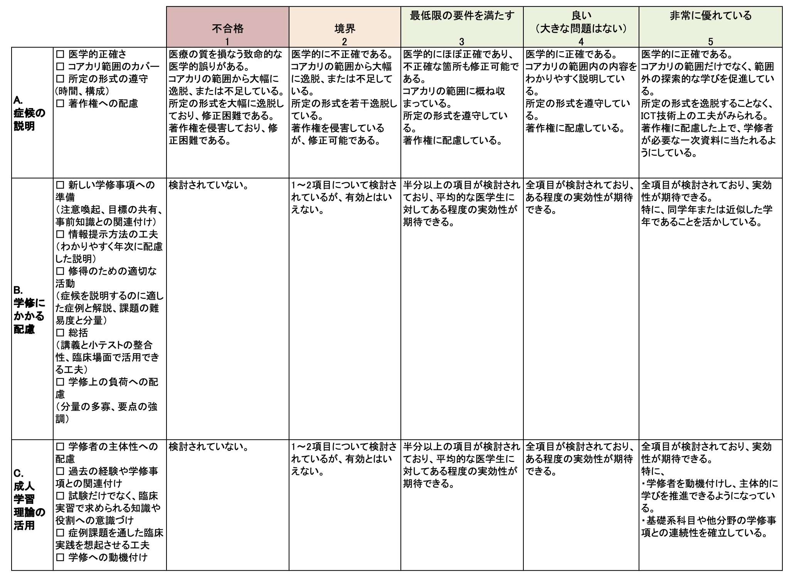

# 方略

## 概要

　同僚と協働して学びを深めるPeer-assisted Learning (PAL)をカリキュラムに取り入れることを目標とし、その達成のために教育方法について学修する機会を設ける。対象は実習中の5～6年次の医学生であり、臨床実習の内科系の5つの診療グループローテーション(2週間×5ターム、計10週間)のうち一人あたり1ターム(2週間)を割り当て、臨床実習前の4年次学生向けのオンデマンド教材を作成してもらう。教える方法については、内科系医師である医学教育センターの兼任教員が成人学習理論、インストラクショナルデザイン等についての動画講義を各20分程度で行う。資料はオンラインストレージを通じて共有する。5～6年生の医学生(各ターム約10名)は上記のうちいずれか1つのターム中に本プログラムに参加するよう、臨床実習開始時にあらかじめ割り当てられている。当該ターム中に、臨床推論の講義を作成するチーム(各タームあたり3症候程度を3〜4名ずつで分担する)を作り、各症候の考え方を概説する事前視聴講義ビデオ(10～15分程度)、臨床推論を学ぶための症例検討を行うオンデマンド講義(30分)、事後の確認テスト(多肢選択式で2問程度)を作成する。作成された教材は、臨床実習初年度である4年生が臨床推論の授業期間中に自習し、レポートとして解答を提出する。

## カリキュラム開発の背景

　医学生が医学生を教えるStudent as Teachersの概念は広がりつつある[@Hill_2011]。米国では、2010年の調査で、ピアティーチングへの関心も認められ、回答した130の医学部のうち99(76％)が、医学プログラム中にピアティーチングに医学生を利用したことが示されている。回答した学校の57(44％)は、彼らを正式な教育者としてのトレーニングプログラムを提供したと報告している[@Soriano_2010]。PALをカリキュラムに取り入れる目的は、プロの教育者ではない学修者と同様の社会集団の人々が、互いに学び合い、教えることによって自分自身の学びが促進されることにある[@Topping_1996]。PALを進める学年は臨床実習中の学生が最も効果が高く[@Brierley_2021]、臨床実習の医学生は教育のスキルを学ぶのに有意義である[@Burgess_2014]。この点から、臨床実習中の学生に焦点を当て、PALが実践できるよう教育を提供する。
 
## どのような方法で教えるのか？

### ・オンラインでの講義：講義作成に必要とされる基礎的な知識である成人学習理論や効果的な教育を作成するための方法論(インストラクショナルデザイン[@ISBN9781119373827]の動画講義を20分程度で行う。

### ・教員とのミーティングとフィードバック：5～6年生が作成した講義ビデオや確認テストのフィードバック、講義の打ち合わせ

### ・経験学修：オンライン講義を4年次前期の医学生に5～6年生の医学生が実施する(教員はサポートする)。

### ・振り返り：教員と学生同士で振り返りを行い、総括的評価、形成的評価を行う(詳細は評価の項参照)。

## 誰が教えるのか？

　内科系医師である医学教育センターの兼任教員(2名が分担：動画作成について支援できる教員がいればなおよい)

## 講義・実習等の時間はどのくらいか？

### ・オンラインでの講義　30分～40分

### ・教育学修者とのミーティングとフィードバック　30分×2回：講義ビデオや確認テストのフィードバック、講義の打ち合わせ -講義　30分 -振り返り　60分(20分×3)

## 講義・実習等の場所はどこか？

　ウェブ会議システム、LMS

## 教える学生の数は何人程度か？

　PALを学ぶのは臨床実習中の5～6年生10名 (教える対象は臨床実習前の4年生110名)

## カリキュラム評価

　事前視聴ビデオとライブ講義の対象となった医学部4年生とこれらを視聴した教員に自由記載アンケートを実施する。これらのフィードバックや全体の取り組みを振り返り、5～6年生の医学生に、どのような学びがあったかについて自由記載アンケートを実施する。

## 講義・実習を行う際に必要なヒト(模擬患者含む)・モノ等は何か？

　ウェブ会議システム、LMS、講義資料

# 評価

## 概要

　成果物をルーブリック(別表)を用いて評価するとともに、文書によるコメントを返却する。さらに、作成者にむけ、優れていた点と改善すべき点を具体的に記したコメントを記載する。ルーブリックとコメントは、匿名化した状態で作成者である学修者に渡される。さらに、コメント内容に基づいた改善計画を学修者に提案して貰い、それも評価対象とする。評価者は教員のほかに同時期にローテーションしていた他チームの学生と教材を用いて学んだ4年生であり、学生からの評価は形成的評価に、教員からの評価は総括的評価に用いる。

## どのような形成的評価・総括的評価を実施するのか？

### ・形成的評価

#### ・誰が評価するのか？

##### ①4年生

##### ②同時期にローテートしていた同学年学生

#### ・誰を評価するのか？

5～6年生

#### ・どのような場面・場所で評価するのか？

##### ①4年生のビデオ教材受講時(学修者には、評価が出揃った時点で一括して提供する)

##### ②ローテート中に実施する振り返り時(通常は最終日に実施する)

#### ・どのくらいの時間をかけて評価するのか？

##### ①15分

##### ②20分

### ・総括的評価

#### ・誰が評価するのか？

内科系医師である医学教育センターの兼任教員(2名が分担)

#### ・誰を評価するのか？

学修者(本プログラムに参加した5～6年生)

#### ・どのような場面・場所で評価するのか？

ローテート中に実施する振り返り時(通常は最終日に実施する)

#### ・どのくらいの時間をかけて評価するのか？

60分(各チーム20分)

#### ・合否判定基準をどのように設定するのか？

本プログラムにおける成果物と他チームへの評価の提出は、内科系ローテーションの修了要件の一つである。また、教員からの成果物評価は内科系ローテーションの総括評価のうち20％を占めており、残りはWorkplace-based Assessmentである(本項では割愛)。ルーブリックで「1」の評価がなく、かつ総括評価が合計して60％以上に達した者を合格とする。

#### ・実施する試験についてどのような外部評価を受けるのか？

学内カリキュラム委員会の臨床実習担当グループが、学生からのアンケート等を参考にして評価を行う。

## その他

　内科系教室の教育連絡会議において、本プログラムの実施状況を適宜意見交換する。

## 参考：評価用のルーブリック

　ルーブリックについては、「学修者評価」の「評価規準と評価基準」の項を参照のこと。本例におけるルーブリックの評価項目は、A. 症候の医学的説明、B. 学修に係る配慮、C. 成人学習理論の活用からなる。このうちBは、Gagneが提唱する、新たな学修項目を扱う際の要点を参考にした。

{width=690}

 

