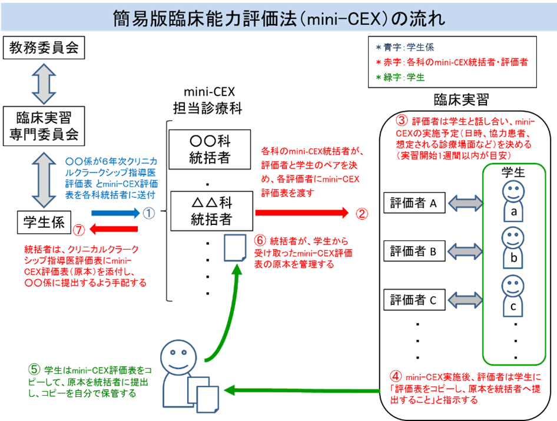

# 評価

## 実習現場での評価

臨床実習の学修目標には、知識や臨床推論、臨床判断等だけではなく、診察や基本的臨床手技等の技能、医師のプロフェッショナリズム等の態度も含まれる。評価方法として、医学知識に関する口頭試問やレポート、ペーパーテストのみでは不十分であるばかりでなく、これらの方法では評価できない技能領域への学修意欲や、態度領域への気づきが臨床実習前より減退していくことすら懸念される。 

診療参加型臨床実習の充実のためには、評価方法として、簡易版臨床能力評価(mini-Clinical Evaluation eXercise、mini-CEX)や直接観察による臨床手技の評価(Direct Observation of Procedural Skills、DOPS)、症例の担当に関する評価(Case-based Discussion、CbD)、指導医以外の他の医療スタッフ等からの評価(360 度評価)等の実習現場での観察評価や、実習活動の記録に基づいた評価を採用することが求められる。また、これらの学修と評価については、臨床実習前から始まっていることを学生が認識しておく必要があり、実習前の準備も含めて学生へのオリエンテーションを行うことが必須である。 

評価は、学生の成績、単位認定、修了判定に用いられる総括的評価と、学生への指導、フィードバックに用いられる形成的評価がある。臨床実習で学生を指導する時、指導者は実習中に実習の現場で学生の学修レベルを評価しながら、そのレベルにあった指導をすることが必要であり、それが形成的評価である。上記の観察評価や活動記録は、実習中の学生の指導(フィードバック)に活用される。また総括的評価の根拠となる情報としても活用されることが考えられる。 

評価尺度として、医学生として望まれる能力を満たす場合に 4(臨床実習修了時(卒業時)のレベル)を、それ以上の場合に 5(臨床研修の中間時点で期待されるレベル)、6(臨床研修の終了時点で期待されるレベル)を、ボーダーラインで 3(臨床実習の中間時点で期待されるレベル)を、能力が明らかに劣る場合に 2(臨床実習開始時のレベル)、1(臨床実習開始前のレベル)を付けることが考えられるが、評点を付けることよりも、適切なフィードバックを行うことが重要である。 

### (1) 簡易版臨床能力評価　mini-CEX

　学生が医療面接（病歴聴取）や身体診察を行う際に、指導医が直接観察して、下記に挙げた観点から学生のその臨床能力を評価し、フィードバックする。

#### ①病歴聴取
#### ②身体診察
#### ③コミュニケーション能力
#### ④臨床判断
#### ⑤プロフェッショナリズム
#### ⑥マネジメント
#### ⑦総合

mini-CEX 評価者向けの説明例
mini-CEX（簡易版臨床能力評価）は、学生の診察技能評価のため臨床的な設定（入院病棟、外来、当直、救急等）において、学生が患者と関わる様子を15～20分程度観察します。
【評価者】
原則として、教員が分担して評価して下さい。ただし指導体制上実施が困難な場合は、直接観察した医師（医員、専攻医、大学院生等）も可とします。
【目的】 
①学生が実習中に自分の到達度や、どのような事が不足して何を学修しなければいけないのかを定期的に把握するため行います。②各診療科が総括評価の参考とします。
【評価の基準例】 
1) 病歴：①初診外来の場合は現病歴で聞くべきこと（症状の部位・性状・程度・経過・状況・増悪寛解因子・随伴症状・患者の対応）を聞いたか。最低限聞くべき他の項目（既往歴・アレルギー・内服薬・女性の月経と妊娠）を聞いたか。状況が許せば聞くべき他の項目（生活状況・家族状況・嗜好等）を聞いたか。正確で十分な情報を得たか。②入院中の患者の場合はでその時点で把握しておくべき情報をしっかり聞けたか。
2) 身体診察：その時点で取ることが望ましい項目をチェックしたか。鑑別診断を立てるために取るべき項目をチェックしたか。患者に何をするかを説明し、不快感や遠慮に配慮したか。
3) コミュニケーション：患者が話しやすいように話を聞いたか。視線や表情や姿勢等の非言語コミュニケーションで不快感を与えなかったか。患者の解釈モデルや心理社会面についても情報を引き出したか。患者の理解度を確認したか。
4) 臨床判断：診断的検査を適切に選択し、指示・実施したか。患者にとっての利益とコスト・リスクを考慮したか。可能性の高い疾患、見落としてはいけない疾患を考えたか。
5) プロフェッショナリズム：患者に対して敬意、思いやり、共感を示し、信頼関係を形成したか。患者の不快感、遠慮、守秘義務、個人情報につき注意を払ったか。
6) マネジメント：適切な治療方法を選んだか。アセスメントとプランを患者が納得いくように説明したか。患者が何に注意したらいいか、次にどういう行動をとったらいいかを説明したか。
7) 総合：優先順序を適切につけたか。タイミングがよかったか。無駄が少なく迅速だったか。患者も評価者も納得でき、有効な判断をしたか。観察者がいなくてもこの患者を一人で診察できたか。
※4)、6)、7)については、患者診察の後、学生の考えを述べてもらい評価しても構いません。
【評価・フィードバックの方法】 
1) 学生と患者のやりとりを直接観察してください。診察室に同席するか、カーテンの影に隠れているかは自由です。できるだけ学生と患者の両方の表情を観察してください。学生から質問されたとき、または学生が自分の判断で患者に説明したことに重大な誤りがあるときを除いて、基本的には評価者は学生の診察に口を挟みません。
2) mini-CEXを記入して下さい。１から６まで点（３点以下は学生が標準に達するような改善が必要であることを意味します）をつけますが、点を付けることよりも、適切な指導（フィードバック）をすることが重要です。
3) できるだけ間を置かずに、印象が残っているうちに、診察について学生に直接フィードバックをしてください。“ダメ出し”だけではなく、良かった点も挙げてください。
4) 評価表に評価者と学生のサインを記入してください。 
5) 学生に「コピーして原本を診療科のmini-CEX統括者に提出すること」と指示してください。

{width=548}

### (2) 直接観察による臨床手技の評価　DOPS
　
　学生が臨床手技を行う際に、指導医が直接観察して、下記に挙げた観点から学生のその臨床能力を評価し、フィードバックする。

①適応、解剖、手技の理解
②インフォームド・コンセントの取得
③事前の準備
④技能
⑤清潔操作
⑥安全への配慮・援助の要請
⑦手技後の管理
⑧コミュニケーション
⑨プロフェッショナリズム
⑩総合（概略評価）
注）すべての観点を評価することは必須ではない。

### (3) 症例の担当に関する評価　CbD

　学生の患者への関わりに関して、診療録記載や症例記録に基づき学生と議論をして、下記に挙げた観点から学生のその臨床能力を評価し、フィードバックする。（症例カンファランス、病棟回診、カルテ回診等）

①診療録記載
②臨床診断（アセスメント）
③診療計画
④プロフェッショナリズム
⑤総合（概略評価）
注）すべての観点を評価することは必須ではない。

### (4) 360 度評価
　実習中の評価者については、指導医として、教員以外に行動をともにすることが多い同じチームの研修医、また、特に態度の評価については、医療スタッフや学生の担当患者等医師以外の評価者を設定する（360 度評価）ことも検討されるべきである。また、これらの評価表など、学修過程で作成・入手した成果物を蓄積した「学修と評価の記録」を指導医とともに振り返ることも、学修を促す重要な形成的評価となる。さらに、学生が臨床実習を振り返る機会を定期的に設定し、各人の学修目標の達成度や具体的体験の機会等を相互に共有し、評価することにより、技能領域への学修意欲及び態度領域への気づきの維持・向上を図ることも考えられる。

### (5) 臨床実習におけるアンプロフェッショナルな行動について[@木村_武司2022], [@Papadakis_2005], [@Nishigori_2014], [@Martinez_2017], [PMID: 25399044]

　医師として生涯にわたって研鑽していくことが求められる資質・能力としてプロフェッショナリズムが挙げられているが、特に臨床実習におけるアンプロフェッショナル（以下、アンプロ）な行動が問題となることがある。アンプロな行動とは医師として望ましい行動に反するだけでなく、患者安全のアウトカムへの影響しうることが示されており、またその後の研修以降のキャリアでも同じような問題を起こす可能性も指摘されている。

　プロフェッショナリズムについて低学年から学び身につけていく必要があるが、特に臨床実習では対患者、対多職種スタッフのみならず、教員や学生間も含めた観察可能な発言や行動について評価すべきである。以下に、一例を示す。

第1段階

　教員、学生間でのアンプロな行動について具体的な発言、行動を定義・共有する。大学によってはホームページで公表している。これらは、観察、評価可能な発言や行動であり、価値観や性格などではないことに注意する。
（例：京都大学　http://cme.med.kyoto-u.ac.jp/sd/unprofessional.pdf）

　軽微か重大かという線引きは各大学で行うべきだが、患者安全や医療現場のスタッフ等に直接与える影響などを考慮する必要があると考える。

第2段階

　臨床実習を担当する教員、職員は第1段階で共有された定義に基づき、観察・評価をおこなう。アンプロと思われる行動については、その都度適切にフィードバックを行う。その際に一方的なフィードバックにせず、状況の確認などを確認する必要がある。また精神疾患や発達障害、メンタルの不調、またその背景としての人間関係や家族の問題などがないか面談等で評価を行う。特に繰り返し報告された場合や重大な案件では保護者との情報共有も必要である。

第3段階
　
#### ①フィードバックを行った当該学生について、アンプロな言動が改善するか引き続き観察・評価を行う。すぐに次の診療科へ移るようであれば情報共有・引継ぎを行う。
#### ②アンプロな行動が繰り返される場合や重大なアンプロ行動が見られた場合は、学部全体で共有し再教育・指導について検討する。大学によってはアンプロな行動の定義やアンプロ行動を起こした学生についての協議は該当委員会や教授会で行われる。より個別の指導や対応が必要である。
　再教育・指導の際には該当学生について精神疾患や発達障害、メンタルの不調、またその背景としての人間関係や家族の問題等についても配慮が必要で、適切に専門的なサポートが得られるようにすべきである。

第4段階
　
　臨床実習を継続させるのか、再履修とするべきかについて検討する。再教育・指導による改善状況やメンタリングやカウンセリング、追実習についての評価が必要であるが、透明性のある評価が求められる。

医学生のアンプロフェッショナルな行動の報告書（例）

学年 　　　　　学生氏名 
実習病院と診療科 　　　　　　　　　実習期間 
医学生のアンプロフェッショナルな行動について記載してください。 その際に指導した内容、またその際の聞き取り内容(その行動に至った事由)、その後 の改善状況などについてもわかる範囲で記載をお願いいたします。 
報告者 ○○病院 ○○科 氏名 
診療科長署名 
宛先　住所　○○　　　　メールアドレス ○○　　　　　(メール送付の場合は PW をつけるなど個人情報管理にご注意ください。) 
※一人の指導医が提出する 1 枚の評価表で学生の留年が決定することはありませんので、学生の態度・行動で気になる点があり、指摘しても変わらないようであれば、積極的に記入、提出いただくようお願いいたし ます。 

## CC-EPOC

これらの評価の結果を、学生が実習中に学んだ資料とともに、実習活動の記録（ラーニング・ポートフォリオ）として蓄積していくことについて、方略の項で述べた。このポートフォリオを評価の対象として再構築することで、臨床実習の評価により真正性（authenticity）が向上し、学生の望ましい学修を促進することに加えて、臨床実習から臨床研修までの継続的な評価が可能となることが期待できる。

　評価及び実習活動の記録を電子的に行うツールとして、CC-EPOC（卒前学生医用オンライン臨床教育評価システム）の利用も有用と考えられる。

（CC-EPOCのシステム構成図）

{width=566}

