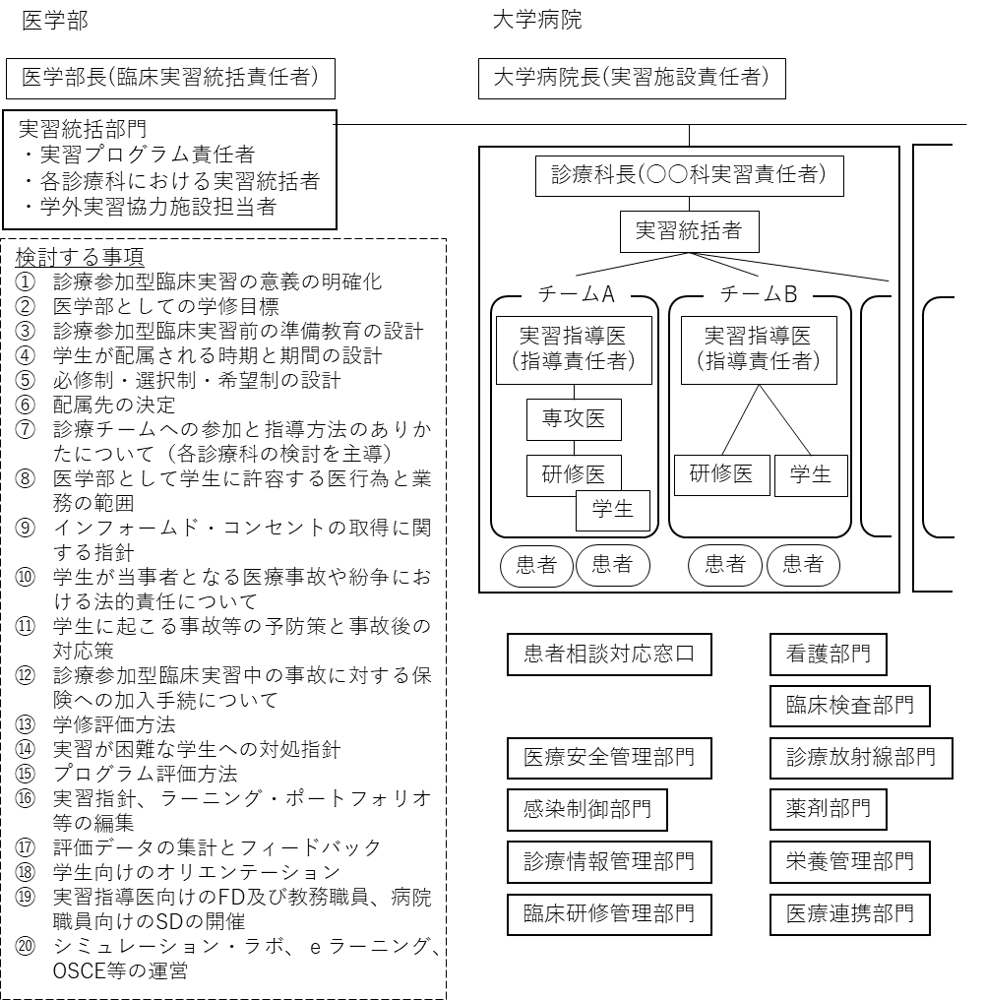
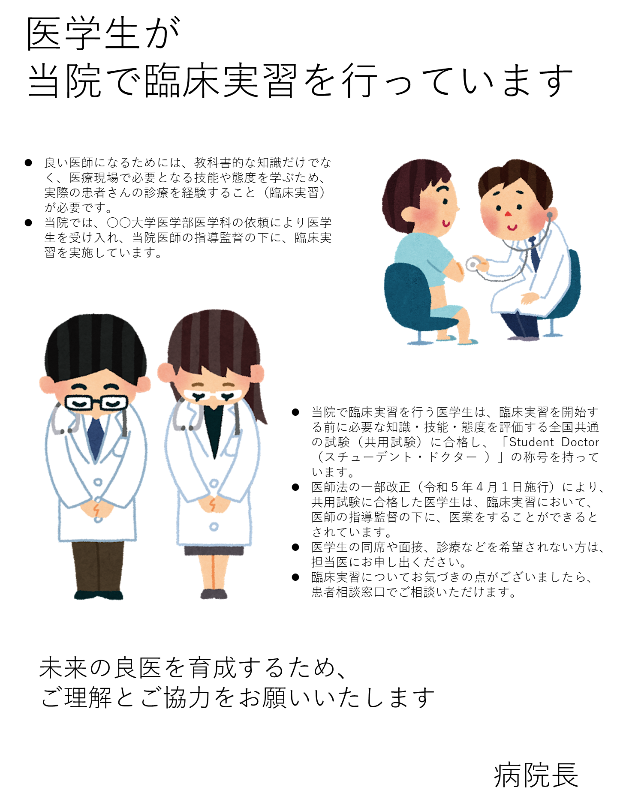

Ⅱ.# 実施体制・実施環境

1．## 実施組織

導入した診療参加型臨床実習をより効果的な実習に改善していくために、学生の診療参加に対応できる組織体制を整備して取り組む必要があり、以下の点が重要である。

### (1)組織的に取り組むこと 

#### 1)医学部長、教授会、教務委員会、事務部、医学教育センター等の教育組織の役割の強化と、大学病院、実習 協力病院との円滑な連携により、臨床実習全体として一定の水準が保てるように管理する。 

#### 2)医学部として統一する事柄と、各臨床科に決定が委ねられる事柄を分ける。 

### (2)教育機能をもった診療体制を構築すること 教育機能をもった診療体制を整備する。すなわち、学生が診療チ ームの中に組み込まれ、学生の果たす役割と責任の重さが段階的に増加するような制度をつくる。 

### (3)指導医、診療チーム、病棟職員等の教育能力の向上 診療に参加することに対する学生の自覚を促すととも に、指導医、診療チーム、病院職員等の理解を促し教育能力を向上させる。＜ファカルティ・ディベロップメ ント(以下「FD」という。)：教員・指導医・指導者向け研修会、スタッフ・ディベロップメント(以下「SD」 という。)：事務職員向け研修会＞（１）組織的に取り組むこと

1. 医学部長、教授会、教務委員会、事務部、医学教育センター等の教育組織の役割の強化と、大学病院、実習協力病院との円滑な連携により、臨床実習全体として一定の水準が保てるように管理する。
1. 医学部として統一する事柄と、各臨床科に決定が委ねられる事柄を分ける。

（２）教育機能をもった診療体制を構築すること
教育機能をもった診療体制を整備する。すなわち、学生が診療チームの中に組み込まれ、学生の果たす役割と責任の重さが段階的に増加するような制度をつくる。
（３）指導医、診療チーム、病棟職員等の教育能力の向上
診療に参加することに対する学生の自覚を促すとともに、指導医、診療チーム、病院職員等の理解を促し教育能力を向上させる。＜ファカルティ・ディベロップメント（以下「FD」という。）：教員・指導医・指導者向け研修会、スタッフ・ディベロップメント（以下「SD」という。）：事務職員向け研修会＞

また、以下の実習関係者の役割を明確にし、的確に役割を果たせるよう、実習統括部門を整備し、診療参加型臨床実習を実施する組織全体を統括する必要がある。

### ①医学部長と医学部教授会
### ②教務委員会、事務部、医学教育センター等
### ③大学病院、実習協力病院
### ④各診療科における実習責任者および実習統括者
### ⑤各診療チームを指導する医師
### ⑥研修医
### ⑦学生
### ⑧医師以外の医療職

## ２．実習統括部門の整備

全学的な実習体制の整備をはじめ、今後の診療参加型臨床実習の充実にかかる＜実施→評価→改善＞の改革サイクルを実行するシステム構築、課題の解決に大きく寄与することが期待される。実習統括部門に想定される役割を以下に列挙する。

### (1) 診療参加型臨床実習の意義の明確化

### (2) 医学部としての学修目標

### (3) 診療参加型臨床実習前の準備教育の設計

### (4) 学生が配属される時期と期間の設計

### (5) 必修制・選択制・希望制の設計

### (6) 配属先の決定(全科、主要な科、受け入れを希望する科)

### (7) 診療チームへの参加と指導方法の在り方について(各診療科の検討を主導)

1. ### (1) 診療参加型臨床実習の意義の明確化
1. ### (1) 医学部としての学修目標
1. ### (1) 診療参加型臨床実習前の準備教育の設計
1. ### (1) 学生が配属される時期と期間の設計
1. ### (1) 必修制・選択制・希望制の設計
1. 配属先の決定（全科、主要な科、受け入れを希望する科）
1. 診療チームへの参加と指導方法の在り方について（各診療科の検討を主導）

### (8) 医学部として学生に許容する医行為と業務の範囲

### (9) インフォームド・コンセントの取得に関する指針

### (10) 学生が当事者となる医療事故や紛争における法的責任について

### (11) 学生に起こる事故等の予防策と事故後の対応策

### (12) 診療参加型臨床実習中の事故に対する保険への加入手続について

### (13) 学修評価方法

### (14) 実習が困難な学生への対処指針

### (15) プログラム評価方法

### (16) 実習指針、ラーニング・ポートフォリオ等の編集

### (17) 評価データの集計とフィードバック

### (18) 学生向けのオリエンテーション

### (19) 実習指導医向けの FD 及び教務職員、病院職員向けの SD の開催

### (20) シミュレーション・ラボ、ｅラーニング、OSCE 等の運営 

1. (引用) 診療参加型臨床実習における望ましい教育体制のあり方(@DOI:10.11307/mededjapan1970.35.9)から抜粋し加筆修正した。医学部として学生に許容する医行為と業務の範囲
1. インフォームド・コンセントの取得に関する指針
1. 学生が当事者となる医療事故や紛争における法的責任について
1. 学生に起こる事故等の予防策と事故後の対応策
1. 診療参加型臨床実習中の事故に対する保険への加入手続について
1. 学修評価方法
1. 実習が困難な学生への対処指針
1. プログラム評価方法
1. 実習指針、ラーニング・ポートフォリオ等の編集
1. 評価データの集計とフィードバック
1. 学生向けのオリエンテーション
1. 実習指導医向けのFD及び教務職員、病院職員向けのSDの開催
1. シミュレーション・ラボ、ｅラーニング、OSCE等の運営

（引用）
第13期日本医学教育学会卒前教育委員会．診療参加型臨床実習における望ましい教育体制のあり方．医学教育2004, 35(1): 9～15.[@Yamamoto20049] から抜粋し加筆修正した。
https://www.jstage.jst.go.jp/article/mededjapan1970/35/1/35_1_9/_pdf/-char/ja

診療参加型臨床実習を実施する組織体制（例）

{width=548}

- 医学科全体の臨床実習を統括する部門を医学部（科）長の下に置く。

- 診療科長を中心とした指導の責任体制を明確にする。

- 指導責任者間の調整、臨床実習の管理を行う実習統括者を診療科長の下に置く。

- 指導に直接当たる指導責任者を配置する。

- 指導医の指示のもとで安全性を確保し、研修医と学生の間及び学生間で先輩が後輩を指導するような体制を構築する。

- チームの診療体制において、学生、研修医、チームの指導責任者の役割、行動について具体的に明確にする。

※ 大学によって医学教育部門（医学教育センター等）の規模や役割は異なるため、各大学の状況に合わせて実習統括部門を整備する。

3．## 臨床実習実施に必要な実習関係者等

1. ### (１) 実習指導医

　診療科等において臨床現場で医学生を指導および評価する。実習指導に関する FD を受講していることが強く推奨される。

### (２) 医師以外の医療職（メディカルスタッフ）

1. 

　診療参加型臨床実習では、医学生が医療チームの一員として診療に参加することから、看護師、薬剤師、臨床 検査技師等、医師以外の医療職種全てが医学生の指導に関係する。とくに、研修医の真正な評価には、医師以外 の医療職種や患者･家族等からの評価も含めた、「360 度評価」が望ましい。 診療参加型臨床実習では、医学生が医療チームの一員として診療に参加することから、看護師、薬剤師、臨床検査技師等、医師以外の医療職種全てが医学生の指導に関係する。とくに、研修医の真正な評価には、医師以外の医療職種や患者･家族などからの評価も含めた、「360 度評価」が望ましい。

### (３) 診療科等における実習統括者

1. 

　実習統括部門で実習プログラム責任者とともに臨床実習プログラムの企画・立案に関与し、実習診療科責任者 の管理の下、診療科等での実習の実施及び評価の業務を統括する。実習指導に関する FD を受講していることが 強く推奨される。原則 7 年以上の臨床経験を有し、プライマリ・ケアの指導方法等に関する講習会(指導医講習 会)を受講していることが望ましい。 実習統括部門で実習プログラム責任者とともに臨床実習プログラムの企画・立案に関与し、実習診療科責任者の管理の下、診療科等での実習の実施及び評価の業務を統括する。実習指導に関するFDを受講していることが強く推奨される。原則 ７年以上の臨床経験を有し、プライマリ・ケアの指導方法等に関する講習会（指導医講習会）を受講していることが望ましい。

### (４) 実習診療科責任者

1. 

　臨床実習が実施される診療科等の責任者として、その診療科等における実習の企画・立案および及び実施を管理するとともに、評価の業務を統括する。

1. ### (５) 実習プログラム責任者

　　医学部の臨床実習関連実務を統括し、臨床実習プログラムの企画・立案及び実施の管理、並びに医学生に対する助言、指導その他の援助を行う。

　

1. ### (６) 管理者

　医学部・大学病院・実習協力施設全体で医学生の臨床教育を行う体制を支援し、実習統括部門の業務が円滑に行われるよう配慮しながら、臨床実習全般を統括管理する。

1. ### (７) 実習施設責任者

　大学病院、実習協力施設の施設長として、医学部と連携し、実習プログラム責任者と密に連絡を取りながら、 臨床実習が円滑に実施されるよう支援する。臨床実習指導にあたっての責任は医学部が負い、診療に関する責任 は実習施設が負うが、法的な問題が生じた場合には、実習施設の責任者として医学部と協議し処理する。 　大学病院、実習協力施設の施設長として、医学部と連携し、実習プログラム責任者と密に連絡を取りながら、臨床実習が円滑に実施されるよう支援する。臨床実習指導にあたっての責任は医学部が負い、診療に関する責任は実習施設が負うが、法的な問題が生じた場合には、実習施設の責任者として医学部と協議し処理する。

1. ### (８) 事務組織

　
　医学部（教務担当、実習統括部門担当等）、病院（研修担当、医療安全管理担当、感染制御担当等）間の連携を円滑に実施できる体制が強く求められる。

### (９) 患者相談対応窓口

1. 

医学生の診療参加型臨床実習を推進するにあたって、既存の患者相談窓口等を活用することも含め、患者からの臨床実習に関する相談にも対応できる窓口を設置するとともに、それを周知するよう努めていく必要がある。

4．## 学外実習協力医療機関

モデル・コア・カリキュラムに掲載された、地域の実情に応じた医療・介護・保健・福祉の現状及び課題を理解し、医療の基本としてのプライマリ・ケアの実践、ヘルスケアシステムの質の向上に貢献するための能力を獲得する方法として、病診連携・病病連携、地域の救急医療、病院前救護体制・メディカルコントロール、緊急度判定体系、在宅医療、多職種連携のチーム医療、地域における疾病予防・健康維持増進の活動を体験することが考えられるため、学外の医療機関に実習協力を依頼し、学生を派遣する必要がある。
また、大学病院は学外施設に比べて癌など特定の患者の割合が高く、高度先進医療機関として、診断や治療が困難な複雑あるいは稀な病態や、先進的な医療研究の目的のための検査治療方針である患者等、学外施設とは異なる症例が多く集まる傾向がある。従って、一般に頻度の高い症候・疾患や、初期・二次救急、あるいは一般レベルの検査治療など、モデル・コア・カリキュラムにおいて臨床実習で経験すべきとされる病態や疾患を全学生が経験するためには、臨床実習の全期間を大学病院だけで行うのではなく、積極的に学外の実習協力機関へ配属した方がよいとの意見がある。
また、臨床推論の学修を実践的に始める環境として、比較的長く複雑な病歴をもつ患者が集まりやすい大学病院よりも、比較的短く単純な病歴の患者が集まりやすい学外の実習協力機関の方が適しているとの意見もある。一方、実習期間を長くし、かつ大学病院の負担を軽減するため、学外施設に臨床実習を一部委託するなどの工夫をしている大学の事例が報告されている。
以上から、各大学は、大学病院及び学外実習協力医療機関における経験可能な症例をモデル・コア・カリキュラム別表5：主要症候を参考に調査し、現状で必修目標とする経験症例が不足する場合には、必要に応じて大学病院の診療部門の再構成を提案するとともに、密接な教育連携の下、学外実習の協力医療機関への配属も検討することが望ましい。
　学外実習協力医療機関での臨床実習を実施する際は、医学部と学外実習協力医療機関の両機関との間で以下を協議し、協定書を締結する。指導医の委嘱については、必要に応じて臨床教授制度等を利用することが考えられる。

（１）必修あるいは共通学修目標、診療参加型臨床実習であることの詳細、評価方法、実習をめぐる危機管理の体制や対応方針等について取り決める。
（２）学生の交通費や宿泊施設等について個別に検討する必要がある。

::: {.note}
●●大学医学部学外実習協力医療機関における臨床実習に関する協定書（例） （目的） 第１条　この協定は、●●大学医学部（以下「学部」という｡）が、●●病院（以下「病院」という｡）の協力を得て、医学科学生（以下「学生」という｡）の臨床実習の充実を期することを目的とし、●●大学医学部長（以下「学部長」という｡）と«病院名»長（以下「病院長」という｡）との間で協定を締結する。 （協力内容） 第２条　学部は病院に対し、臨床実習指導にかかる協力を文書により依頼し、病院はその諾否について回答するものとする。 ２　前項の臨床実習指導に当たっての責任は学部が負い、診療に関する責任は病院が負うものとする。 （学生の資格） 第３条　病院で臨床実習を行うことのできる学生は、その能力を有するものであることを共用試験の合格及びその他適切な方法で適正に資格認定された者とする。 （指導医） 第４条　病院に実習学生の指導助言を行う指導医を置くものとする。 ２　前項の指導医は、学部長と病院長が協議の上選任する。 ３　臨床実習の場面に応じて、研修医を含む指導医以外の医師及び、状況によっては看護師やその他の病院職員が直接の指導・監督に当たることもできるが、その場合も指導責任は指導医にあり、最終的には病院長の管理責任とする。 （実習方法等） 第５条　病院における実習診療科、実習学生数、実習期間、実習内容、実習方法等については予め両者が協議の上申合せを行うものとする。 （学修の目標） 第６条　学生は正規のカリキュラムとして学部で決定された「臨床実習の手引き」に具体的に明示されている学修目標に到達するように学修する。 ２　学修目標は病院の診療上の必要や現実的制約によって、病院と学部とで協議し、妥当な範囲で変更することがある。 ３　指導医は「臨床実習の手引き」に則った学生の学修を支援するものとする。 （学修の方略） 第７条　学生は「臨床実習の手引き」に則った方略で学修する。これは、概ねクリニカルクラークシップに準じているが、病院の診療上の必要や現実的制約によって、病院と学部とで協議し、妥当な範囲で変更することがある。 ２　学生に許容される医行為の範囲は、モデル・コア・カリキュラムに収載されている「医学生が臨床実習で行う医業の範囲」を参考にする。 ３　医行為は学生が目標に到達するための方略として許容されるものであって、その経験や修練が目標とされるものではない。 ４　必修項目とされている医行為であっても、病院の診療上の必要や現実的制約又は指導医の判断で、見学にとどまることもある。 ５　学生は臨床実習において、初対面の患者には自己紹介し、指導者の口添えの下に学生であることを告げて、患者の承諾を得るものとする。 ６　学生は指導医の指導・監督の下に医行為を行うものとし、独断で医行為を行ってはならない。 （学修の評価） 第８条　病院は「臨床実習評価表」又は「選択臨床実習の記録」に則って評価を実施するように努めるものとする。 ２　病院の診療上の必要や現実的制約によって、評価の方法を病院と学部とで協議し、妥当な範囲で変更することがある。 （臨床実習に関する教育資源及び謝金） 第９条　病院は臨床実習に必要な教育資源を用意するものとする。 ２　臨床実習の指導に対する病院への謝金は、学部の定めるところにより、1診療科につき１日　　　　　　　円とする。 （諸規則の遵守） 第10条　学部長は、学生に対し病院における諸規則を遵守させ、病院の業務に支障を生じさせないよう指導するものとする。 ２　学生は患者のプライバシーの保護に常に留意し、臨床実習に際して知り得た患者情報を他に洩らしてはならない。 （問題の処理） 第11条　臨床実習に際して、何らかの問題が生じた場合には、その問題の種類と程度に応じて指導医、病院長等適切な者が処理に当たるものとする。 ２　法的な問題が生じた場合には、病院長と学部長とで協議し、若しくはその両者が適切と認める専門の担当者又は専門機関において処理するものとする。 ３　病院長は、学生の臨床実習中の事故については、病院職員の職務遂行中の事故に準じて取り扱うものとする。 ４　学部長は、学生が予め事故に備えた保険に加入していることを確認する。 第12条  病院長は学生が臨床実習で学修するのに相応しくないと認められた場合には、学部長と協議して、臨床実習を続けることを取り消すことができる。 （協議連絡） 第13条　この協定に定めのない事項で必要が生じた場合は、その都度協議を行うものとする。 （協定期間） 第14条  この協定の期間は、２○○○年 ４月 １日から２○○○年 ３月３１日までとする。 本協定の成立を証するため、本書２通を作成し学部長及び病院長が記名捺印の上、双方で各１通を保有する。 ２○○○ 年    月    日 ○○大学医学部長　　○○　○○ ○○病院長　　　　　　　○○　○○
:::

5．学生の安全管理

1. 実習時間

　労働基準法では、労働時間は1週40時間、1日8時間、労働時間6時間超で少なくとも45分の休憩、労働時間８時間超で、少なくとも１時間の休憩を与えることとされている。学生は労働者ではないため各労働法規の適用を受けないが、学生の安全と健康、実習外の学修時間の確保のため、実習統括部門において実習時間の考え方を示すことが望ましい。
（例）
　実習時間は実習病院指導医の裁量によるが、１⽇あたり計 7.5 時間（実習６時間＋昼⾷と休憩1.5 時間）を基本とする。ただし、各診療科の診療スケジュールやプログラムに応じて、開始や終了の時間などを変更できる。
　学⽣が実習時間の延⻑を希望する場合は、指導医と相談のもと、⾝体・精神的負担に配慮しながら適宜調整できる。

1. 健康管理
1. 定期健診

　学校保健安全法に基づき、学生には定期健康診断を行わなければならない。

1. 抗体価検査・ワクチン接種

診療参加型臨床実習では患者との接触が増えるため、実習を運営する医学部と、院内感染対策を徹底する大学病院との間で、以下の観点について協議の上、学生に対し、麻疹、風疹、水痘、ムンプス、B型肝炎等の抗体価検査やワクチン接種等を受けさせる必要がある。

- 病院内に持ち込まれる病原体から患者を守る。
- 学生及び教職員を院内・院外の感染源から守る。

1. 障害や実習で使用する物品・薬品等にアレルギーを有する学生への対応

障害や実習で使用する物品・薬品等にアレルギーを有する学生については、大学が学生間の公平性の確保に留意し慎重かつ十分に検討の上、実習を計画し実施する。

1. 放射線被ばく管理

診療参加型臨床実習に参加する学生の電離放射線被ばく管理を行うことは学生の安全確保のために重要である。学生の電離放射線被ばくについて、以下に指針を示す。

- 電離放射線被ばくのおそれのある臨床実習は必要最小限に限定すべきである（放射線照射中は操作室等の可能かつ合理的な範囲で被ばくのおそれの無い場所での見学にとどめる等）。
- 学生を放射線診療従事者として取り扱うかどうかは、臨床実習の内容に応じて、大学（大学病院）で判断する。
- 学生を放射線診療従事者として取り扱う場合は、放射線診療従事者として事前の放射線健康診断、放射線教育と個人モニタリングが必要である。
- 学生を放射線診療従事者として取り扱わない場合でも、適切な方法で線量管理・記録等（例えば、電子式ポケット線量計貸与、管理区域への入退室記録等）を行うべきである。

6．医療安全管理・感染対策（医療事故の予防策・事故後の対応策）

1. 学生に障害が起こる事故（針刺し・血液体液ばく露を含む）について

実習指導医等は、規則的生活を維持し、常時、心身の調子を整えるように適宜学生へ注意を与えるとともに、日頃から学生とのコミュケーションをとり、不調を訴えた際は適切に対処する。
各診療科に共通する血液等を介する感染事故等については、その防止対策及び事故発生時の迅速な対処方法について院内感染対策マニュアルに準じた指針を作成し、関係者に周知しておくことが望ましい。特に、血液等を介する感染事故を発生しやすい医行為については、感染予防のための指導を充分行うとともに、そのような医行為を学生が行うことについては、危険性等を学生に充分説明したうえで学生の同意を文書等で取得しておくことが望ましい。
実習に入る前に、Ｂ型肝炎等の抗体価検査とワクチン投与を実施する必要がある。その際、経費の負担と実施体制について検討する必要がある。
事故が発生した場合は、指針に従って迅速に対応するとともに、事実経過を実習統括部門等に報告し、また文書として記録保存しておくことも必要である。

1. 学生の行為により患者に障害が起こる事故について
1. 指導に当たる医師の指示に基づく医行為等
1. 当該病院等において、学生がチームの一員として医療に関わっていく上において、当該学生による直接的な医行為等（学生による介助中の患者の転倒・転落等を含む）により、患者に障害が起きた場合、当該医行為等を受けた患者は当該病院と契約関係にあり、かつ指導に当たる医師は当該病院の職員として業務を遂行しているので病院の経営者が民法上の使用者責任を問われる場合がある。
1. 事故の状況によっては、病院管理者が職員である指導に当たる医師及び学生に対し、応分の責任を問うことがある。法律上の損害賠償責任をいずれがどの程度負うかは、当事者間の話し合いあるいは民事訴訟の結果による。
1. 事故の状況やその後の対応によっては、学生に医行為を指示した指導に当たる医師個人の責任を問われる可能性がある。法律上の損害賠償責任が指導に当たる医師個人にどの程度あるかは、最終的には民事訴訟の結果による。
1. 当事者の話し合いや民事訴訟の結果に従って指導に当たる医師が責任を問われた場合、指導に当たる医師が医師賠償責任保険に加入していれば、補償金が支払われる。調査した範囲では、学生は約款で「補助者」と表現されているものに含まれるとみなされ、事故は加入している医師の直接指揮監督下にある看護師、放射線技師等による事故として扱われ、補償金が支払われるとされている。しかし、各保険会社との契約に当たってはその内容について、個別に調査、確認が必要である。

1. 指導に当たる医師の指導・監督外の行動

　民事訴訟の結果当該事故について法律上の賠償責任が学生にあるとされた場合、学生が責任を問われる場合がある。しかし、学生が賠償責任保険（次々項）に加入していれば、故意に起こした事故でない限り、国内において、臨床実習中の学生が患者に対して行った行為によって、患者の身体、生命を害し、または財物を損壊したことにより負担する法律上の賠償責任の実額が、保険会社より補償される（例えば、病院内を通行中の患者に偶然衝突して傷害を負わせた場合）。ただし、このような場合でも、実習の場を管理している病院の経営者も賠償責任を問われる可能性は残る。

1. 学外実習協力医療機関における臨床実習中の医療事故の対応について

事前に協議の上、臨床実習中の医療事故の対応について協定書に明記しておく。

1. 学生が加入すべき傷害保険・損害賠償責任保険

事故補償の対策としては、日本国際教育支援協会が損害保険会社と契約して実施している「学生教育研究災害傷害保険」及び「医学生教育研究賠償責任保険」に加入することが望ましい。掛金の支払いをどのように負担するか、また、未加入の学生に、加入学生と同じ範囲の医行為を許容するかどうかについては各大学において検討する必要がある。

1. インシデントや院内暴力発生時の対応

　診療参加型臨床実習では、他の病院職員と同様に、学生も病院の医療安全管理部門の管理下に入るため、病院職員と同様のマニュアル（院内安全対策マニュアル等）を理解し、常に携帯し、それにしたがって対応するよう、医療安全管理部門と協働して指導する必要がある。
また、学生が関係したインシデントの報告方法を整理し決定しておく必要がある。

（院内暴力対策の例）
::: {.note}
院内における暴力・暴言等発生時の対応 適応レベル レベル１　暴言・セクシャルハラスメント ・「ばかやろう」、「アホ」、「ふざけんじゃない」等の侮辱、又は名誉を棄損する言動（侮辱罪、名誉棄損罪） ・性的な関心・欲求に基づく内容の確認 レベル２　脅迫・暴力行為及び器物の破損 ・「脅迫」は言葉による不当な要求、相手を不利な立場に追い込み損害を与えることを示唆する内容（恐喝罪、脅迫罪） ・「暴力行為」は身体には触れるが、傷害には至らないもの（暴行罪、威力業務妨害罪、偽計業務妨害罪） ・「器物破損」はその名の通り、設備や備品、機械、装置等を壊すもの（器物損壊罪） ・しつこく居座る、何度も電話をかけてくる、ストーカーまがいの行動 ・セクシャルハラスメント（身体的接触を伴うもの） ・凶器となりうる物体を所持し、注意に従わず放棄しない行為 レベル３　治療を要する障害 ・叩かれた、殴られた、蹴られたなど。一般に傷害と判断されるもので、精神的な障害を含めて、その後の業務に支障を来す程度のもの（治癒までに約1週間以内程度の休業を要するもの） ただちに警察に通報する（傷害罪、威力業務妨害罪） レベル４　重大な傷害事件（死亡事故を含む）（傷害罪、傷害致死罪、殺人罪） ・入院を要するか、治癒までに約1週間以上の休業を要するもの。精神的な障害も同様 ・傷害を起こすことを意図して、刃物や器物を用いての暴力等 ・事件性を有するものはすべて含まれる ただちに警察に通報する ※なお現行犯の逮捕（身柄の確保）は一般人でも行うことが出来る（刑事訴訟法） 発生時の対応 レベル１、２　平日：保安安全対策室長（PHS○○○○○）あるいは医療サービス係（内線△△△△）に連絡。当事者等が説得に応じない時は１１０番通報する レベル３、４　ただちに１１０番通報する 【通報内容】 □発生時刻 □発生場所 □被害を受けるに至った経緯 □関係者及び目撃者の有無 □怪我の状況 □その他 １．怪我人が出たら、ただちに医師に治療を要請すること。 （原則、当該科医師に連絡。当該科が不明あるいは連絡がつかない場合は救急部に連絡） ２．第一に患者及び職員の安全確保を優先すること。 ３．相手の話をよく聞き、暴力行為の防止に努力し、暴力の応酬は決して行わないこと。 ４．当事者等の関係者は、レベル１の場合は、記憶が鮮明なうちに必要に応じて診療録に記載すること。レベル２以上の場合は、「暴力（傷害等）発生報告書」を記録し、医療サービス係（内線△△△△）に提出すること。
:::

other :[UNSUPPORTED(isContainer:false)]

7．医学生が臨床実習で行う医業の範囲
診療参加型臨床実習において医学生が実施する医行為の考え方について「医学生が臨床実習で行う医業の範囲に関する検討会 報告書（令和４年３月1 5 日）」の抜粋を以下に示す。

::: {.note}
臨床実習における医行為の違法性阻却の条件と今般の法改正との関係について - 臨床実習で医学生が行う医行為に関しては、前川レポートにおいて、「医師法で無免許医業罪がもうけられている目的は患者の生命・身体の安全を保護することにあるため、医学生の医行為も、その目的・手段・方法が、社会通念から見て相当であり、医師の医行為と同程度の安全性が確保される限度であれば基本的に違法性はないと解釈できる」と整理されている。そのうえで、違法性が阻却される際の条件として「①侵襲性のそれほど高くない一定のものに限られること、②指導医による指導・監督の下に行われること、③臨床実習に当たり事前に医学生の評価を行うこと、④患者等の同意を得ること」とされている。 - 門田レポートにおいても、前川レポートの違法性阻却の整理について再検討されたが、「現状においてもこの考え方は妥当」とされた。また、門田レポートでは指導医によるきめ細やかな指導・監視が必要とされ、これは「医学生が医行為を実施していることを認識し、かつ、必要があれば直ちに制止・介入できる状況であり、医師の医行為と同程度の安全性を確保」することとしている。 - これらの整理は、医学生の医業が改正医療法等により医師法に位置付けられて以降も、臨床実習における医学生の医行為を行う条件として、引き続き妥当であり、医学生が臨床実習の中で行う医行為については、引き続きこれまでの考えに沿って行うべきであると考えられる。
:::

1. 学生が診療業務を行うことについての法的位置付け

令和５年４月１日施行の改正医師法では、臨床実習を開始する前に習得すべき知識及び技能を具有しているかどうかを評価するために大学が共用する試験（以下「共用試験」という。）に合格した医学生は、臨床実習において医師の指導監督の下、医業（政令で定めるものを除く。）を行うことができることとされたが、医学生が臨床実習で行う医業の範囲に関する検討会 報告書（令和４年３月1 5日）では、

- 引き続き、大学における臨床実習を統括する部門の管理の下で、患者の安全性を確保しながら、適切に指導監督されること
- 患者の同意については、当面の間は、院内掲示のみをもって同意とするのではなく、例えば入院患者に対して包括同意を文書で取得し、さらに侵襲的な行為を行う際には個別同意を取得するなども検討するべき

とされている。また、医学生が臨床実習で行う行為について、

- 医学生が臨床実習の中で医行為を実施するに当たっては、各大学の統括部門が定めた医行為の範囲を遵守すること
- 医学生がその定められた医行為を実施するかどうかについては、現場で指導監督を行う医師が、患者の状況と医学生の習熟度等を勘案して決定すること
- 各大学が臨床実習で行う医行為の範囲の決定において、門田レポートを参考とすることも考えられる

とされている。なお、医療安全や学生保護等の観点から医師の指導監督の下であるとしても、医学生が行うことができない医業として、処方箋の交付が政令に定められている。

1. 医師養成の観点から医学生が実施する医行為の例示について（門田レポート）

　医学教育における臨床実習の在り方について、平成30年7月に厚生労働省より公表された門田レポートにおける医学生に許容される医行為の範囲の例示（「医師養成の観点から臨床実習中に実施が開始されるべき医行為（必須項目）」と「医師養成の観点から臨床実習中に実施が開始されることが望ましい医行為（推奨項目）」）を以下に示す。

| 分類 | ① 必須項目 医師養成の観点から臨床実習中に実施が開始されるべき医行為 | ② 推奨項目 医師養成の観点から臨床実習中に実施が開始されることが望ましい医行為 |
| -- | -- | -- |
| 診察 | 診療記録記載（診療録作成）※1 | 患者・家族への病状の説明 |
|  | 医療面接 | 分娩介助 |
|  | バイタルサインチェック | 直腸鏡・肛門鏡 |
|  | 診察法（全身・各臓器） |  |
|  | 耳鏡・鼻鏡 |  |
|  | 眼底鏡 |  |
|  | 基本的な婦人科診察 |  |
|  | 乳房診察 |  |
|  | 直腸診察 |  |
|  | 前立腺触診 |  |
|  | 高齢者の診察（ADL 評価、高齢者総合機能評価） |  |
| 一般手技 | 皮膚消毒 | ギプス巻き |
|  | 外用薬の貼付・塗布 | 小児からの採血 |
|  | 気道内吸引※2 | カニューレ交換 |
|  | ネブライザー | 浣腸 |
|  | 静脈採血 |  |
|  | 末梢静脈確保※2 |  |
|  | 胃管挿入※2 |  |
|  | 尿道カテーテル挿入・抜去※2 |  |
|  | 注射（皮下・皮内・筋肉・静脈内） |  |
|  | 予防接種 |  |
| 外科手技 | 清潔操作 | 膿瘍切開、排膿 |
|  | 手指消毒（手術前の手洗い） | 嚢胞・膿瘍穿刺（体表） |
|  | ガウンテクニック | 創傷処置 |
|  | 皮膚縫合 | 熱傷処置 |
|  | 消毒・ガーゼ交換 |  |
|  | 抜糸 |  |
|  | 止血処置 |  |
|  | 手術助手 |  |
| 検査手技 | 尿検査 | 血液型判定 |
|  | 血液塗抹標本の作成と観察 | 交差適合試験 |

|  | 微生物学的検査（Gram 染色含む） | アレルギー検査（塗布） |
| -- | -- | -- |
|  | 妊娠反応検査 | 発達テスト、知能テスト、心理テスト |
|  | 超音波検査（心血管） |  |
|  | 超音波検査（腹部） |  |
|  | 心電図検査 |  |
|  | 経皮的酸素飽和度モニタリング |  |
|  | 病原体抗原の迅速検査 |  |
|  | 簡易血糖測定 |  |
| 救急※3 | 一次救命処置 | 電気ショック |
|  | 気道確保 | 気管挿管 |
|  | 胸骨圧迫 | 固定など整形外科的保存療法 |
|  | バックバルブマスクによる換気 |  |
|  | ＡＥＤ※2 |  |
| 治療※4 | 処方薬（内服薬、注射、点滴など）のオーダー | 健康教育 |
|  | 食事指示 |  |
|  | 安静度指示 |  |
|  | 定型的な術前・術後管理の指示 |  |
|  | 酸素投与量の調整※5 |  |
|  | 診療計画の作成 |  |

※１ 診療参加型臨床実習実施ガイドライン「学生による診療録記載と文章作成について」を参考に記載する
※２ 特にシミュレータによる修得ののちに行うべき
※３ 実施機会がない場合には、シミュレータによる修得も可である
※４ 指導医等の確認後に実行される必要がある
※５ 酸素投与を実施している患者が対象

1. 各大学の実習統括部門が定める医学生が臨床実習で行う医業の範囲

医学生が臨床実習で行う医業の範囲に関する検討会報告書で示されているように、各大学が臨床実習で行う医行為の範囲の決定において、上記の門田レポートの「医学生に許容される医行為の範囲の例示」を参考にすることが考えられる。ただし、必修項目として治療に挙げられている「処方薬（内服薬、注射、点滴など）のオーダー」については、政令により、処方箋の交付は医学生が実施できる医行為から除かれていることから、処方薬の計画と処方箋の下書きにとどめる必要がある。
以上を勘案し、各大学の実習統括部門は医学生が臨床実習で行う医業の範囲を定める。医学生が臨床実習の中で医行為を実施するにあたっては、医師の指導監督の下で定めた医行為の範囲を遵守することが必要である。また、医学生がその定められた医行為を実施するかどうかは、現場で指導監督する医師が患者の状況と医学生の習熟度等を勘案して決定する。

1. 学生による診療録記載と文書作成について
1. 学生が診療録へ自ら参加した診療内容を記録する意味
1. 診療参加型臨床実習の教育効果上必要であり、学生が診療に参加した事実を記録する。
1. 看護記録等と同様、医師の補助者による記録として扱われる。
1. 指導医の補助者として指導医による検討結果を記録する。
1. 一方で診療録は公文書であり、学生が記載に慣れていない場合など、学生による記載が適切でない状況も考えられる。従って、各大学が必要に応じて、個別に以下のような指針等を整備する必要がある。

::: {.note}
診療録記載の手順（例示） 診療録は公文書であるので、学生が診療録記載に充分慣れていることを指導医が判定するまでの期間は、以下の手順で記載すること。 1. 学生は、まず下書きを手持ちの手帳等に書き、これを指導に当たる医師に見せる。 1. 指導に当たる医師は、下書きを見ながら適切で正確な表現か、医学用語で記載されているかなどを評価する。 1. 学生は、指導に当たる医師が加筆、訂正した内容に沿って、診療録を記載する。 1. 指導に当たる医師は、学生記入の最後尾に署名する。 1. 訂正部分は二重線を引き、訂正し、訂正印を押す。 1. 学生が診療録記載に充分慣れていると判定された後も、指導に当たる医師の執筆・署名は必要である。
:::

また、学生向けの資料として以下のとおり例示する。

::: {.note}
診療録の書き方（例示） 臨床実習ではみなさんが関わった診療についての記録も求められます。また診療録は公文書の扱いとなり、その記載内容には責任が伴います。以下を参考にして、わかりやすく間違いのないように診療録記載を行って下さい。 1. 何のために診療録を書くか 1. より良き診療を行うために 1. 診療の経過を記録として残し、主治医が交代しても、患者個人の医療の継続性が保たれる。 1. 主治医不在時に、他の医師が患者の急変に適切に対応できる。 1. 指導医が主治医の方針を理解し助言ができる。 1. 医療スタッフが医師の方針を理解し、チーム医療がスムーズに行われる。 1. 診療が行われた証拠として記録を残す 1. 保険医として診療報酬を請求する医療行為の根拠となる（保険医は診療録を記載する義務があります）。 1. 患者からその患者の診療録の開示を求められうる。 1. 患者の請求(入院に対する保険金支払い等)に応じて診療経過を証明する際の証拠となる。 1. 医療過誤等の訴訟の対象となったときに、自らの医療が適切に行われていたことを証明する根拠となる。 1. 何を記載するか 1. 「患者が来院した理由、既往歴・生活歴・家族歴等の背景、来院後の病状の変化、主治医の考える診断の進め方、診断名、治療方針、検査・治療の内容、患者や家族への説明等、患者の診療に必要な全ての事項」が記載されている必要がある。「既往歴、原因、主要症状、経過等」と「処方・手術・処置等」は保険医として記載が義務付けられている。 治療内容の中には、入院診療計画書や退院療養計画書、検査や手術等の説明内容やそれに対する同意書、服薬指導依頼箋、栄養指導依頼箋、リハビリテーション依頼箋等が含まれる。 1. 保険請求する上では、実際に行ったことを記録として残すことが求められるものがある。　例：呼吸心拍監視の点数観察した呼吸曲線、心電曲線、心拍数の観察結果の要点を診療録に記載した場合に算定 1. 記載上の注意 1. 毎日記載することを原則とする(記載のない場合は、診察していないか、又は医学的な判断をしていないと判断される恐れがある)。 1. 日付は忘れずに、正確に記載する。(年/月/日の順に記載) 1. 署名することにより、記載した医師が誰であるか明らかである必要がある。 1. 診断書など、医師の氏名欄に押印が必要とされるものについては、訂正箇所にも訂正印を押す。 1. 誰が読んでも同じ内容として理解されるように、分かりやすい文字で、分かりやすく記載する必要がある。 1. 一部の医師(医療従事者)の間でしか通用しない略号は使用しない。 1. 診療録の記載の具体的説明 1. 病歴 1. 現病歴に記載すること 病歴を聴取することで患者に起きた出来事に関する情報の収集と、聴取の過程の会話を通して、患者との信頼関係を構築することを目的とする。 主訴:患者の自覚する苦痛、または、受診目的を記載する。 現病歴:上記の目的を達するため、患者の苦痛の種類(困っていることは何か)、と鑑別診断に必要な情報全てを時間の流れとして記載する。鑑別診断を行う上で必要と判断し聴取した内容(例えば、発熱を主訴に来院した患者について、呼吸器感染症を疑って聴取した咳の有無、痰の症状等)や、鑑別診断の鍵となる所見については、陰性所見(例えば、「発熱はなかった」など)であっても記載する。また、他の医療機関に受診した経過がある場合には、受診日時、他院での診断・治療内容・治療による病状の変化、なども記載する。 1. 既往歴に記載すること 過去に罹患した疾患名と罹患時期 (過去の出来事であっても現在の主訴に関連した事項は現病歴に記載) アレルギー歴、輸血歴、アルコール歴や喫煙歴 常用薬、月経及び出産歴 1. 生活・社会歴に記載すること 職業、出身地、旅行歴等 1. 家族歴に記載すること 家系図の記載、罹患疾病や死因・死亡年齢 遺伝性疾患が問題となるときには該当疾患を有する患者の有無 ・記入に際し、日本人類遺伝学会が提唱する記号を用いる。 ・同居者は同一枠内に囲む。 1. 身体所見の書き方 1. 記載の内容 未記載事項が指定されている場合、すべての項目を埋める。 大きく分けて、病歴から疑われる疾患の鑑別に必要な所見 (腎血管性高血圧を疑う患者での腹部動脈の血管雑音の有無等)と、全ての患者でとるべき基本的身体所見 (血圧、脈拍、黄疸、貧血等)を記載する。 1. 記載する順番 所見を取る順番は、緊急の場合を除き常に一定の順番で、頭から足方向へ、診察する。所見をとる順番と同じ順に記載する。 1. 入院時のまとめ 1. 入院時の問題点をプロブレムリストとしてまとめ、重要な問題点から#番号を付けて記載する。 1. 入院時点での診断名 1. 主鑑別に挙がる疾患リスト 1. 検査計画 1. 治療計画 以上をまとめた後、入院診療計画(変更)書を記載する。 1. 毎日の経過の記録 1. 時間毎にSOAPで毎日記載することが原則(慢性疾患の場合には1週2回以上)、入院時にまとめたプロブレムリストの#番号ごとにSOAPで記載する。 S (Subjective)　自覚症状(本人の訴え、自覚症状) O (Objective)　他覚的所見(身体所見、検査所見) A (Assessment)　評価(主治医の考える病態、診断名、重症度や治療の緊急度の判断) P (Plan)　計画(検査や治療方針、コンサルトの予定、指示) このほかに、実施した治療、手術・処置、検査等と、検査結果、結果に対する評価等を記載する。 1. コンサルテーションをした場合やカンファレンス、グループ長や科長の回診時のコメント、指示事項等も記載する。
:::

 2)   電子カルテについて
電子カルテが導入されている場合等においては、学生が閲覧できる範囲を臨床実習上必要な患者等に限定することや、学生による入力が行われる場合、指導医等が確認・修正・加筆を行うことなど、診療情報の電子化等を踏まえた取り扱いを検討することも必要である。例えば以下のような過程で、医学部と大学病院との間で体制を構築することが望ましい。

1. 大学病院のカルテ委員会等、医療情報、医療政策、医療安全及び医学教育の専門家によるワーキンググループを設置する。
1. 学生による電子カルテと紙カルテ、及び正規のカルテと模擬カルテの使用に関する意義や課題について検討し整理する。
1. 電子カルテの基本仕様と学生が使用する際の遵守事項を策定する（以下例示）。

::: {.note}
電子カルテの使い方（例示） 病院情報システムは、患者の個人情報に関するネットワークです。臨床実習で効果的に活用するためには、下記の使用方法を正しく遵守してください。個人情報保護法が平成17年4月に全面施行され、違反した場合は法的にも厳しい処分があります。病院・施設内で得た個人情報は、個人情報保護の観点から、実習・教育以外の目的で利用したり口外したりしてはいけません。 【注意事項】 1. 学生は自分のユーザーアカウントとパスワードを確認して覚える。（「ユーザーアカウント」とは、利用者認識のための記号や番号のことです。これらの識別記号は、自己の責任において管理し、メモに書いたり、人に教えたりしてはいけません。） 1. 「ログイン」後、 「ログオフ」するまでは、その場を離れてはいけません。「ログイン」とは、署名・捺印に等しい行為です。誰がいつログインしたのか記録されています。自分以外のアカウントとパスワードでログインすることは禁止されています。また、利用が終了したときは、速やかに自分自身で「ログオフ」してください。 1. 自分自身がログインした電子カルテではなく、誰かがログインし、使用中の画面には絶対に触らないようにして下さい。職員の使用環境と学生の使用環境は異なっています。 1. できるだけデスクトップ型のPCを使用するようにしてください。ノート型PCは職員が緊急で使用する可能性が高いので、許可を得てから使用するようにしてください。また、許可なく端末の設置場所を移動させてはいけません。 1. 学生は、受け持ち患者の診療情報のみ閲覧することができます。 1. 受け持ち患者以外の患者の情報は入手しないこと、秘密は絶対に漏らさないことを厳守してください。 1. PCトラブルやわからないことなどはすぐに確認してください。フリーズした場合にも放置してはいけません。必ず報告して対処してください。 1. 手術室や集中治療室は、特殊な使用環境にありますので、使用方法を指導教員に確認し、実習中の状況に応じて使用するようにしてください。 以上の利用上の注意をよく守って、最大限に活用してください。問題行為があった場合には、利用が禁止されることがありますので、注意してください。
:::

       3)  診断書の作成について
診断書については、診察した医師の責任のもと作成されていることから、診断書の作成を医学生が実施することについて、各大学は、医学生の臨床実習の範囲を明確にし、また、指導医においては、患者の不利益が生じないよう指導監督する必要がある。

1. 個人情報の保護について

診療参加型臨床実習の実施にあたっては、事前に個人情報の取り扱いに関する学修や指導を徹底することが必要である。その際、実習開始前に、患者優先の原則に基づく安全確保に努めること、診療情報を適切に取り扱うこと、指導医の指示に従うこと、診療技能や態度の向上に努めること、病院の諸規定とともに医学生に求められる倫理的なモラルや規範を遵守することを学生に誓約させ、病院の諸規定等に違反した場合には大学による所要の措置が行われることを理解させることも必要である。
さらに、令和５年４月１日施行の改正医師法では、医師法第17条の３において、共用試験に合格し臨床実習に参加する学生は守秘義務が課せられていることを周知する必要がある。
個人情報保護に関しては、個人情報保護法等の法令に基づき、各病院（医療安全管理部門や診療情報管理部門等）で定めたポリシーを、病院職員と同様に学生にも遵守させる必要がある。

8．患者の同意

1. 院内掲示

大学病院は高度医療を提供する機関・研究機関としての役割がある一方で、医師を育成する教育病院でもあり、大学病院を受診する患者から医学教育への理解を得ることが重要である。医学生が病院内で臨床実習を実施していることを病院の適切な場所に掲示し、来院者に周知することが求められる。同様に、学外実習協力医療機関においても、来院者に臨床実習への理解と協力を求める院内掲示を行うことが必要である。

（院内掲示の例）
　

{width=340}

1. 患者同意の必要性

　令和２年の「医道審議会医師分科会報告書」（厚生労働省）において、医学生が行う医行為に関する患者同意について、将来的に患者の理解が進んだ場合、一般的な処置について、特別な患者同意の必要なく、診療参加型臨床実習において実施可能となることが望ましいとされた。しかしながら、令和５年４月１日施行の改正医師法では、共用試験に合格した医学生は、臨床実習において医師の指導監督の下、医業（政令で定めるものを除く。）を行うことができることとされているが、令和4年の「医学生が臨床実習で行う医業の範囲に関する検討会報告書」（厚生労働省）において、大学病院は教育病院であり医学生等における教育の場であるという認識が一般の国民に必ずしも十分根付いていない現状においては、当面の間は、院内掲示のみをもって同意とするのではなく、例えば入院患者に対して包括同意を文書で取得し、さらに侵襲的な行為を行う際には個別同意を取得するなども検討するべきとされている。門田レポートでは、

1. 医学生が当該患者の診療活動に参加するないし見学・介助することについて、臨床実習で医学生が行う医行為の範囲を示した上で、患者から「包括同意」を文書または口頭で得ること。
1. 包括同意の取り方については入院時等の説明文書や、医師、看護師等による口頭での説明等様々な方法が可能であるが、口頭で同意を得た場合には、その旨を診療録に記載すること。また「包括同意」を得た後でも、患者はこれを撤回する権利がある旨も含めて説明すること。
1. 別添の例示（「医学生に許容される医行為の範囲の例示」）にないものについて、別添に例示された医行為と同等の侵襲度・難易度のものと各大学・実習施設で考えるものを、教育上の必要性を考慮して、臨床実習で取扱う医行為の範囲に含める場合には、包括同意を取る際に、個別に説明を行う必要があること。
1. 意識レベルの低い患者に対する診療時や、救急診療等、事前の同意取得が困難な場合は、事後、速やかに同意を取得することが望ましいこと。

と整理している。
　「医学生に許容される医行為の範囲の例示」にあっても、侵襲性が高いものや羞恥的と判断される医行為や、平成26年の全国医学部⻑病院⻑会議「診療参加型臨床実習のための医学⽣の医⾏為⽔準策定」において、指導医の実施の介助・見学が推奨される（レベルII）とされた医行為（下記）などについては、包括同意ではなく個別に同意をとることも考えられる。

| ②指導医の実施の介助・見学にとどめることが推奨される医行為（レベルⅡ） |  |
| -- | -- |
| 一般手技 | 中心静脈カテ挿入、動脈採血・ライン確保、腰椎穿刺、膀胱洗浄、ドレーン挿入・抜去、全身麻酔、局所麻酔、輸血、眼球に直接触れる治療、各種診断書・検案書・証明書の作成 |
| 検査手技 | 脳波検査(判読）、筋電図、眼球に直接触れる検査、超音波検査（判読）、エックス線検査、CT/MRI、核医学、内視鏡検査 |
| 診察手技 | 婦人科疾患の診察、妊婦の診察と分娩 |
| 救急 | 救命治療(二次救命処置等）、救急病態の初期治療、外傷処置 |

　

1. 包括同意

大学及び学外実習協力医療機関において医学生が当該患者の診療活動に参加することについて、各大学の実習統括部門が定めた臨床実習で医学生が行う医行為の範囲を示した上で、入院患者等から「包括同意」を文書で得ることを検討すべきである。なお、口頭で同意を得る場合は、診療録に記載することが望ましい。
以下に、包括同意の説明文を例示する。

包括同意の説明文書（例）
診療参加型臨床実習を行うにあたってのお願い（例示）

□ 診療参加型臨床実習とその必要性
診療参加型臨床実習とは、共用試験に合格した臨床実習医学生（以下「いわゆるStudent Doctorという。：医学部4～6 年生。）が患者さんの診療にあたる診療チームの一員として、患者さんのこれまでの経過を伺い、基本的な身体診察を行った後に、原因となる病気を考え、更にはそれを確認するための検査を選び、最終的に治療方針を決めるという、医療の実際を学んでいくものです。この実習を通して、医師としての態度、技能を学んでいきます。また、この実習で得られたことが、国家試験後の医師臨床研修へと受け継がれ、質の高い医療が提供されることに繋がります。以上のことから、診療参加型臨床実習は我が国での「良き臨床医」を養成するために必要不可欠となっていますので、ご理解とご協力をお願い申し上げます。

□ いわゆるStudent Doctorとしての能力と資格
医学生が診療参加型臨床実習を行うに足る能力（知識、技能、態度）が有るか無いかということは、実習が開始される前に知識・実技試験を含む全国統一の共用試験及び学内独自の試験等を用いて総合的に判定されます。これらの試験に合格し、いわゆるStudent Doctorとしての能力と資格があるた医学生のみが、診療参加型臨床実習を行うことができます。
なお、令和5年4月1日施行の改正医師法では、臨床実習を開始する前に必要な知識及び技能を評価するため厚生労働省令で定める「共用試験」に合格した医学生は、臨床実習において医師の指導監督の下、一定の医療行為が可能とされています。

□ 診療参加型臨床実習で行われる医療行為
診療参加型臨床実習で学生が行う医行為の内容は別表に示してあります。必修項目は医師養成の観点から臨床実習中に実施が開始されるべき医行為です。推奨項目は医師養成の観点から臨床実習中に実施が開始されることが望ましい医行為です。これらの医行為の中でいわゆるStudent Doctorが実施することに同意いただけないものがありましたらお知らせください。また、上記に含まれない医行為を実施する場合などには、その学生に限定した個別の同意をお願いする場合があります。その際は、改めて文書（個別同意書）によってご説明いたします。

□ 医療事故等への補償
患者さんの健康ないしプライバシーを損なうような事象が発生した場合には、医学部長（学長）及び医療施設責任者（病院長等）の責任で適切に対応いたします。

□ 担当以外のいわゆるStudent Doctorないし共用試験合格前の医学生が見学すること、及び担当のいわゆるStudent Doctorが診療の途中で変更することがあること
回診や上記の医行為が行われる場合、担当以外のいわゆるStudent Doctorだけでなく、他のいわゆるStudent Doctorないし共用試験合格前の医学生が一緒に見学をさせていただくことがあります。また実習期間中に担当のいわゆるStudent Doctorが他のいわゆるStudent Doctorに交代することがあります。

□ 拒否できる権利
この診療参加型臨床実習への協力は拒否できます。また、実習への協力を同意された後でも、その同意を解消することができます。その際の用紙もお渡ししますので、同意を撤回する際には担当医に提出をお願い致します。いずれの場合においても、診療参加型臨床実習を拒否することによって、その後の診療等を含め一切、不利益を被ることはありません。

診療参加型臨床実習の包括同意書（例）
::: {.note}
診療参加型臨床実習の包括同意書（例示） □ 診療参加型臨床実習とその必要性 □臨床実習医学生（以下「いわゆるStudent Doctor」）としての能力と資格 □ 診療参加型臨床実習で行われる医療行為  □ 医療事故等への補償 □ 担当以外のいわゆるStudent Doctorないし共用試験合格前の医学生が見学すること及び担当のいわゆるStudent Doctorが診療の途中で変更することがあること □ 拒否できる権利 （拒否内容： 　　　　　　　　　　　　　　　　　　　　　　　　　　　　　　　） ＿＿＿＿＿＿＿＿＿＿＿＿＿＿＿＿＿＿＿＿＿＿＿＿＿＿＿＿＿＿＿＿＿＿＿＿＿ ○○医科大学長/○○大学医学部長/病院長 ○○ ○○ 殿 共用試験に合格したいわゆるStudent Doctorによる診療参加型臨床実習及びその他の医学生も含む見学型臨床実習についての文書を読み、それに対する十分な質問の機会も与えられ、上記の事項に関して十分理解しました。 ２○○○年○○月○○日 患 者 署 名：＿＿＿＿＿＿＿＿＿＿＿＿＿＿＿＿＿＿＿＿ 保護者署名： （未成年の場合）＿＿＿＿＿＿＿＿＿＿＿＿＿＿＿＿＿＿＿
:::

1. 個別同意

　各大学の実習統括部門が定めた医学生が臨床実習で行う医行為の範囲にないものや、範囲にあるが、侵襲性の高いものや羞恥的と判断される医行為については、包括同意に加えて、個別に説明し同意を得ることが望ましい。

個別同意の説明文書（例）
::: {.note}
診療参加型臨床実習を行うにあたっての追加でのお願い（例示） 診療参加型臨床実習にご協力いただくことに関しては、すでに包括同意をいただいておりますが、医学生が次に挙げる医療行為を実施ないし介助することについて、追加でご説明しますので、同意をいただければと存じます。 □ 実習期間 ２○○○年○○月○○日〜○○月○○日 □ 診療参加型臨床実習で行われる医療行為 　○○○○○○○○○○○○○○○○○○ □ 医療事故等への補償 　患者さんの健康ないしプライバシーを損なうような事象が発生した場合には、医学部長（学長）及び医療施設責任者（病院長等）の責任で適切に対応いたします。 □ 拒否できる権利 上記診療参加型臨床実習への協力は否定できます。また、実習への協力を同意された後でも、その同意を解消することができます。その際の用紙もお渡ししますので、同意を撤回する際には担当医に提出をお願い致します。いずれの場合においても、診療参加型臨床実習を拒否することによって、その後の診療等を含め一切、不利益を被ることはありません。
:::

診療参加型臨床実習を行うにあたっての個別同意書（例）
::: {.note}
診療参加型臨床実習を行うにあたっての個別同意書（例示） □ 実習期間 □診療参加型臨床実習で行われる医療行為 □ 医療事故等への補償 □ 拒否できる権利 （拒否内容： 　　　　　　　　　　　　　　　　　　　　　　　　　　　　　　　）　　　　　　　 上記のことについて必要な説明を致しました。 指導医署名：＿＿＿＿＿＿＿＿＿＿＿＿＿＿＿＿＿＿ 医学生署名： （学籍番号）＿＿＿＿＿＿＿＿＿＿＿＿＿＿＿＿＿＿＿ ＿＿＿＿＿＿＿＿＿＿＿＿＿＿＿＿＿＿＿＿＿＿＿＿＿＿＿＿＿＿＿＿＿＿＿＿＿＿＿ ○○医科大学長/ 医学部長/ 病院長 ○○ ○○ 殿 実習で行われる医療行為についての説明を受け、かつそれに対する十分な質問の機会も与えられました。 上記の事項に関して十分理解し、以下の医行為を臨床実習医学生（いわゆるStudent Doctor）が行う実習に協力します。 ・協力いたします（　　　）　　　　・協力しません（　　　） 該当する医行為：＿＿＿＿＿＿＿＿＿＿＿＿＿＿＿＿＿＿＿＿＿＿＿＿＿＿＿＿ ２○○○年○○月○○日 患 者 署 名：＿＿＿＿＿＿＿＿＿＿＿＿＿＿＿＿＿ 　　　保護者署名： （未成年の場合）＿＿＿＿＿＿＿＿＿＿＿＿＿＿＿
:::

9．学生の誓約書
臨床実習の当事者である学生から、事前に患者の個人情報守秘等に関する文書（誓約書）を提出させる必要がある。

::: {.note}
診療参加型臨床実習に関する医学生からの誓約書（例示） ○○大学医学部長、医科大学長 殿 ○○大学病院病院長 殿 ○○○○医療センター病院長 殿 私は診療参加型臨床実習（以下、実習）のオリエンテーションにおいて、以下の内容について指導教員より十分な説明を受け、理解・同意いたしましたので署名いたします。 これに違反した場合には、学則による懲戒を受けます。 1. 「臨床実習指針」に則って実習を行います。実習の内容は、病院の診療上の必要性や現実的制約によって、妥当な範囲で変更することがあることは了解しました。 1. 医行為は臨床実習医学生（以下「いわゆるStudent Doctor」という。）として単独の自己判断で行わず、必ず指導医の指導・監督の下に行います。 1. 担当する患者には、指導医の紹介の下にいわゆるStudent Doctorであることを告げ、指導医とともに実習に対する患者の同意を得ます。       1. 患者などの保有する病原体が血液、排泄物、分泌物を介して自らに感染する危険性及びその予防法について、指導医より事前に十分な説明を受けます。 1. 病棟の管理規則及び指導医または病棟職員による指導に従い、感染防止を含めた医療安全の確保のために、常に十分な注意を払います。 1. 実習中の事故（針刺し事故等）については、病院職員の職務遂行中の事故に準じて取り扱われることを了解しました。 1. 患者の個人情報保護に常に留意し、実習に際して知り得た患者情報を決して他に漏らしません。また自らの実習内容に関係のない情報を閲覧することも決していたしません。 1. 電子カルテの利用に際し「○○大学病院（○○○○総合医療センターなど）において実習等を行なう学生の電子カルテ利用に関する規則」を遵守し、原則として診療情報を印刷いたしません。 2○○○年○○月○○日 ○○大学医学部/医科大学 学籍番号：＿＿＿＿＿＿＿＿＿＿＿＿＿＿＿　氏名：＿＿＿＿＿＿＿＿＿＿＿＿＿＿＿
:::

10．FD・SD
卒前教育における臨床実習で、学生の指導に当たる医師（大学病院の教員、医員、臨床系大学院生、地域医療実習協力病院の医師、研修医等）については、見学型や模擬診療型から診療参加型に移行する場合、学生自身が学修目標を立てる際の指導、臨床推論、臨床判断、診療計画の立案等の指導、技能の指導や評価、あるいは医師のプロフェッショナリズムに関する振り返り等、従来の小グループ講義や見学とは異なる対応が求められる。また、実習が行われる大学病院や学外実習協力医療機関等の職員にとっても、360度評価等の対応が求められる。従って、実習の質の維持・向上のためには、臨床指導法等の修得を目的とするFDやSDを行うことが重要である。これらについては、学内、学外実習協力医療機関等において臨床実習を指導する医師全員や職員を対象に行う必要がある。なお、厚生労働省が定める開催指針にのっとったものであると確認されている「臨床研修指導医講習会」やその他の指導者講習会等を受講した医師は、FD等により習得すべき内容と重複するため、各大学固有の内容（臨床実習の評価等）についての書面配布等で代用することも考えられる。
内容としては、前述の通り、指導医等を対象として、学生自身が学修目標を立てる際の指導、臨床推論、臨床判断の実践的な指導法、簡易版臨床能力評価法等の評価表の使い方、医師のプロフェッショナリズムに関する振り返りの進め方、また、病院職員等を対象として、360度評価の意義と方法等が考えられる。

