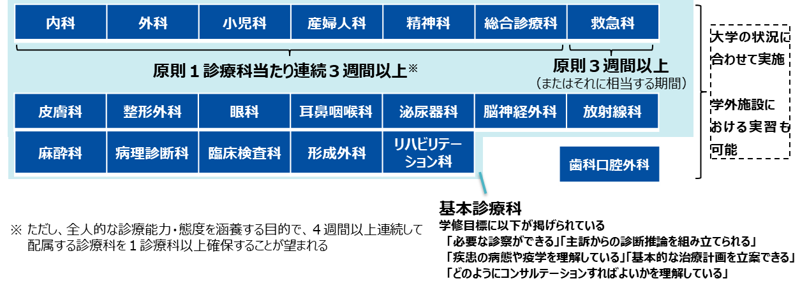
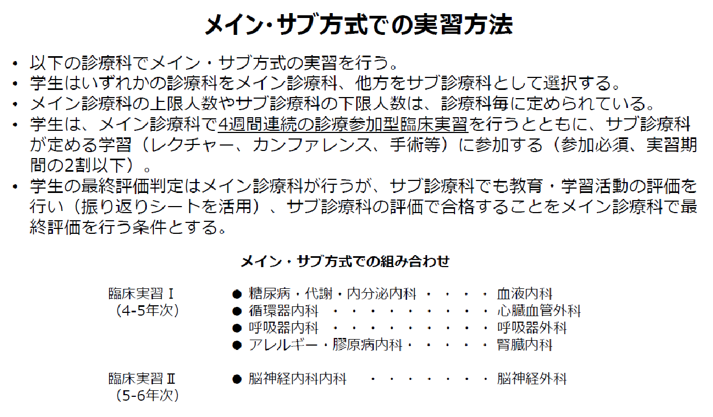
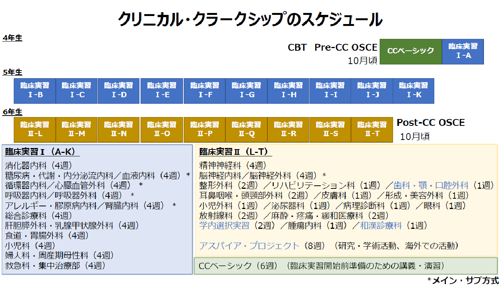

Ⅳ. 方略

1．臨床実習の形態

臨床実習は診療参加型を基本形態とする。診療参加型臨床実習は、「指導医や研修医、さらには看護師や薬剤師等の他の職種も含めた診療チームの中で、医学生が診療チームの一員として一定の役割・責任を担いながら行う臨床実習」と定義される。基本的臨床手技に加え、外来で予診をとる役割や、病棟患者の疾患についての知見（エビデンス）を確認する役割、また患者の検査に同行して不安を和らげる役割等が例として挙げられる。診療現場では、医学生が担うことのできる役割は、一般的に指導医が想定しているよりも大きい。正統的周辺参加論＊を参考に、「些細なことでもよいので臨床現場で実際に役割を担うことによって得られるやりがい」を医学生の学修動機（モチベーション）とできるような臨床実習を構築する。また見学型の臨床実習にならざるを得ない場合は、学生が臨床現場で観察したことを記録して指導医との振り返りでそれを基に討論するなど、積極的な学びになるように実習を計画する。

＊正統的周辺参加論と認知的徒弟制[@SaikiTakuya2012]

2．臨床実習を行う診療科等

　臨床実習においては、いずれの診療科（基本診療科）においても、患者を担当し、その診療に可能な限り参加することで、「必要な診察ができる」、「主訴からの診断推論を組み立てられる」、「疾患の病態や疫学を理解している」、「基本的な治療計画を立案できる」、「どのようにコンサルテーションすればよいかを理解している」という学修目標を達成することが望まれる。
　診療参加型臨床実習として、医学生が診療チームの一員として一定の役割・責任を担いながら実習を行うには、特に、内科（各専門科を含む）、外科（各専門科を含む）、小児科、産婦人科、精神科、総合診療科では、原則１診療科あたり連続３週間以上の配属期間の中で、指導に当たる医師から継続的な評価を受ける必要がある。なお、全人的な診療能力・態度を涵養する目的で、４週間以上連続して配属する診療科を１診療科以上確保することが重要である。災害リスクの高まりや世界情勢等を踏まえ、総合的に患者・生活者をみる医師を養成する観点から、救急科も原則3週間以上（またはそれに相当する期間）の実習が求められる。
　なお、臨床実習を行う診療科等として、基本診療科の他、歯科口腔外科、中央診療部門等での実習も考えられる。また、研究マインドの涵養を目的とした臨床実習の期間における研究活動も考えられる。
　臨床実習を行う場については、一般的な診療において頻繁に関わる負傷又は疾病を経験することの重要性等の理由で、大学病院だけでなく、指導医の質・量が十分に保証された学外実習協力医療機関で行うことも推奨される。また病棟だけでなく、外来も積極的に活用し、十分に経験できない診療内容についてはシミュレーション教育も活用する。総じて全学年を通して、臨床現場を活用した臨床教育を推進することが望まれる。そして、医師として求められる基本的な資質・能力の将来的な獲得に向けて学生が継続的に歩み続けられるようサポートする。

{width=566}

（専門分化した診療科を組み合わせたローテーション方法の一例）

{width=566}

{width=566}

3．実習診療科での学修目標の設定

　「基本診療科において必要な診察ができる」、「基本診療科で主訴からの診断推論を組み立てられる」、「基本診療科における疾患の病態や疫学を理解している」、「基本診療科の基本的な治療計画を立案できる」、「基本診療科にどのようにコンサルテーションすればよいかを理解している」等の学修目標を達成するため、診療科毎に学修目標を設定する必要がある。このとき、将来、該当診療科の医師にならない場合にも必要な該当診療科領域の診療能力という観点から学修目標を設定することが望ましい。
臨床実習において学生がより主体的に学ぶことができるよう、実習の初日のオリエンテーションの際に、学生と教員の間で学修目標を共有する（「学修契約」）。シラバス等で教員側があらかじめ設定している学修目標を基に、学生と教員とで話し合いながら協同して個別の学修目標を設定する。このことによって、その科に興味・関心のある学生はより積極的に学ぶことができ、またあまり興味・関心のない学生も、最低限必要な内容を学ぶことができるようになり、個別性を重視した臨床実習が可能になる。
診療科毎に学修目標を設定するにあたって、実習診療科等をマトリックスを用いて整理しておくことが考えられる。以下にその例を示す。

身体診察のマトリックス表（例）

{width=566}

主要症候のマトリックス表（例）

{width=468}

臨床・画像検査のマトリックス表（例）

{width=566}

基本的臨床手技のマトリックス表（例）

{width=566}

4．診療参加型臨床実習の実際

1. 診療参加型臨床実習の基本的流れ

【入院患者での例】
::: {.note}
1. 毎朝受け持ち患者を診察し、診療録や看護記録等の診療記録・経過表を必ずチェックし、前日や夜起こったことについて把握する。 1. 毎日、患者の状態・検査結果・検査治療計画について指導に当たる医師に口頭で提示し、検討する。 1. 前項について毎日診療録の形式で学生記録を記載する。記載した記録は指導に当たる医師に必ず読んでもらい、指導を受けて署名をもらう。 1. 回診やカンファレンスの時には受け持ち患者を口頭で提示する。 1. ベッドサイドで行われる採血や静脈注射等の基本手技を指導医の指導監督の下で実施する、もしくは見学し指導を受ける。 1. 医療チームと患者、患者家族とで持たれる病状説明や検査治療計画の策定等に参加する。 1. 指導に当たる医師の下で実際に指示箋や処方箋、他科受診依頼等の下書きを作成する。作成した文書を発行する際は、指導に当たった医師が署名を行う。
:::

【外来患者での例】
::: {.note}
1. 割り当てられた初診患者の医療面接と、可能であれば診断仮説に基づいた集約的身体診察を行い、得られた所見から適切な臨床推論を行う。 1. 問題点に則した初期計画（検査計画）を立てる。 1. 指導に当たる医師に口頭で提示し、指導を受ける。 1. 担当した患者について診療録形式の学生記録を記載する。
:::

1. 診療参加型臨床実習の利点
1. 学生の視点から
1. 知識やその使い方（臨床推論、臨床判断、診療計画の立案等）について

講義や机上の自己学習で臨床推論能力を身に付けるには、双方向の講義や症例を準備するなどかなりの工夫が必要となる。しかし、臨床実習では、担当患者のデータや診療方針、その根拠等について自分で教科書や文献を調べたり、指導医とディスカッションしたりすることにより、自然と身につく。

1. 技能について

コミュニケーションや身体診察の技能、基本的臨床手技等については、診療参加型臨床実習の中で、自分で体験することで「できる」ようになる。

1. 態度について

医師のプロフェッショナリズム、すなわち、担当患者やその家族及び他の医療職への接し方、自己の職業的能力とその限界に即した行動、助力と助言の受け入れ、自己学習への意欲、医療における倫理的な考え方や行動、社会人としての責任ある行動等は、一定の責任を持たされた上で、指導医や看護師等とともに診療に従事し、特に病状説明や回復困難な疾患の説明に同席するなどの実地体験をすることで、身に付けることができる。

1. 指導する医師の視点から

指導に当たる医師は、担当中あるいはその他の患者のデータや診療方針、その根拠等について学生に尋ね、知らなければ自己学習を促す（１分間指導法 One Minute Preceptor Model＊）。必ずしも小グループの講義等を実施しなくてもよい。また、"Teaching is learning twice (To teach is to learn twice)"（教うるは学ぶの半ば）と言われており、学生から尋ねられることや学生に教えること等により指導に当たる医師自身が学ぶことにつながる。

＊１分間指導法 One Minute Preceptor Model
臨床現場での指導ノウハウの1つ。以下の6つのマイクロスキルからなる。

   1. 評価・計画を述べさせる
   1. 根拠を確認する
   1. 一般的な原則を教える
   1. 良かった点を誉める
   1. 誤りを訂正する
   1. 更なる学習を勧める

1. 患者の視点から

充分な時間をとってベッドサイドに来てくれる学生は、話し相手として歓迎されるだけでなく、医療者との情報伝達役としても役立つことがある。また、医学生の教育に協力することによって、自己効力感も生じると言われており、患者参加型医療の推進につながることが期待される。

1. 学生が受け持ち患者に接するときの注意点
1. 医療面接と身体診察は、患者の心身状態に配慮し時間をとりすぎない。時間がかかるのであれば、何回かに分けて行う。
1. 大部屋の患者の場合、他者に聞かれて困る可能性が少しでもあれば、面談用の個室を使う。
1. 診察にあたっては患者の心身状態に配慮することが必要だが、過剰に遠慮しないこと。主治医のつもりで行う。
1. 訪室の予定はあらかじめ患者と相談して時間を決め、その時間を守る。その際、患者の日々の経過を把握するため、朝訪れることが望ましい。
1. 実習の開始、終了時及び廊下で会ったときの挨拶など礼を失さない。
1. 最低１日１回はベッドサイドでゆっくりと患者とのコミュニケーションをもつこと。その際、できるだけ聞き役になるように努める。
1. 他科受診、リハビリテーション、検査等の予定を把握し積極的に付き添う。
1. 最初に訪ねたときに「私には何でも尋ねて下さい。学生なのですぐお答えできないことはあると思いますが、主治医の先生や他の先生にお伝えして、できるだけお答えするようにします。」などと述べておく。
1. まだ決定していない診断や治療方針については決して伝えてはならない。例えば「癌ではないでしょうか」と尋ねられたときには、「癌ではないかとご心配なのですね。しかし、私にはよくわからないので、○○さんが、ご自分が癌ではないかと心配されていることを主治医の先生に伝えます。」などと答えるようにする。

1. 指導医が患者診療から離れた教育プログラムを実施する際の注意点
1. 診療に必要な知識の学修については、最小限の講義は必要な場合もあるが、学修効果を高めるタイミングとしては、診療に必要な知識をまず尋ね、本人が知らない（つまり診療ができない）ことを自覚した後に、自己学習を促すのがよいとされている。
1. 担当患者の診療以外で症例学習を行う場合は、臨場感を持たせたシミュレーション形式の問題基盤型学習（Problem-based learning <PBL>）の実施を考慮する。
1. 侵襲的医行為、羞恥的医行為を学生が患者に実施する場合、自大学で事前に決定した学生に許容される医行為であること、また、学生には事前にシミュレータ等で練習させ、当該技能について一定の水準が満たされていることを確認しておく。（例：清潔操作、採血、静脈注射、心肺蘇生、縫合、導尿、泌尿・生殖器の診察等）

1. 指導医及び学生が、学生の診療参加について認識しておかねばならない法的側面
1. 学生は診療への参加が始まる前に大学が定める評価基準（共用試験を含む）を合格している。
1. 医療安全や院内感染対策については、研修や抗体検査・ワクチン接種等、実習が行われる病院の職員と同等の対策が実施されている。
1. 学生による診療録形式の記録や医療文書の下書きは、指導に当たる医師が最終的に執筆・署名する。
1. 学生による医行為は指導に当たる医師の指導・監督の下で行う。
1. 学生に許容される医行為水準は、実習統括部門等により定められており、実習指針に記載されている。
1. 患者あるいはご家族に対し実習の趣旨を説明し、学生を共用試験に合格した「学生」として明確に紹介し、学生が担当し医行為を行うことについて同意を得る。また、同意の取り方についても実習指針に記載されている。

5．複数の診療科で共通する学修目標と方略

学修目標のうち複数の診療科で共通するものについては、学生が継続的に学ぶことができるよう、例えば以下のように指導法やローテーション、評価方法等を工夫する。

（１）　症例呈示や診療録記載など、ほぼ全科に共通する学修目標については「臨床実習全体の学修目標」として設定し、指導に当たる医師の指導法や教材、学修評価・指導体制評価の方法を共通化する。診療科の特性上、学修目標を共通化できない診療科では、その差異を学生に明示しておく。

（２）　一般的に、学生が担当患者や医療スタッフとの良好なコミュニケーションを形成し、診療参加型臨床実習が実質化するには、一定期間以上の配属が必要とされている。責任感や良好なコミュニケーションに基づく診療態度の形成など医師のプロフェッショナリズムの教育をねらいとするためにも、必修の学修目標を学ぶことができる診療科では、学生ができるだけ一か所で継続的に学べ、評価を受けることができるような配属スケジュールが望ましい。また、同じフロアの診療科を続けてローテートできるようにするなど、可能な限り学生の学修環境が継続するような工夫が望ましい。

（３）　ほぼ全科で共通する学修目標以外に、複数の診療科で共通の学修目標を設定できる場合は、診療科間で共通の学修目標を設定し、指導に当たる医師の指導法や教材、学修評価・指導体制評価の方法を共通化し、継続的な指導、評価ができるように工夫する。（例：内科系、外科系、小児科・小児外科、地域医療等）

（４）　医療安全管理や感染対策に関する学修機会として、病院職員向けに実施されている医療安全管理・感染対策研修会を学生に受講させることが考えられる。

5．地域医療実習

　地域の実情に応じた医療・介護・保健・福祉の現状及び課題を理解し、医療の基本としてのプライマリ・ケアの実践、ヘルスケアシステムの質の向上に貢献するための能力を獲得するための方略として、以下が考えられる。

- 学外の臨床研修病院等の地域病院や診療所、さらに保健所や社会福祉施設等の協力を得る。
- 早期臨床体験実習を拡充し、低学年から継続的に地域医療の現場に接する機会を設ける。
- 衛生学・公衆衛生学実習等と連携し、社会医学的（主に量的）な視点から地域を診る学習機会を作る。
- 人類学・社会学・心理学・哲学・教育学等と連携し、行動科学・社会科学的（主に質的）な視点から地域における生活の中での医療を知り体験する学習機会を作る。
- 具体的経験をもとに、学年に応じた知識の積み重ねと統合を繰り返し、臨床実習においてはその知識の具体的活用を練習する機会が望まれる。そのため、複数学年でのらせん型カリキュラム等が考えられる。

6．シミュレーション教育

臨床現場を想定した環境でシミュレーションによるトレーニングを積むことで、実際の臨床現場で対処できる一助となる。診療参加型臨床実習において、学生が侵襲的医行為（相当の侵襲性を伴うと考えられる医行為）及び羞恥的医行為（患者に羞恥心を惹起させるような医行為）を患者に実施すると想定される場合、患者安全の観点から、事前にこれらの教材や施設を活用し、十分教育することが重要である。

- シミュレータを用いて反復練習をすることで、臨床技能を磨く。
- 模擬患者の協力を得て、臨床技能（コミュニケーションスキルを含む）や医療者に求められる態度を身に付ける。
- シナリオを用いたトレーニングを通して、状況判断、意思決定能力を獲得する。
- チームトレーニングによって、チーム医療の実践能力を高める。
- 振り返りによって自己省察能力を高める。
- 仮想現実（Vietual Reality<VR>）や拡張現実（Augumented Reality<AR>)、複合現実（Mixed Reality<MR>）の技術の応用もシミュレーション教育に有効である。

また、従来の心肺蘇生や基本的臨床手技以外にも、緊急性が高く専門医への転送が必要な病態・疾患への初期対応、災害、患者安全、多重課題、比較的対応が難しいコミュニケーション等、実体験による学修が困難な医療場面の教育方略として、シミュレーション教育プログラムの開発と普及が望まれる。特に、緊急性が高く専門医への転送が必要な病態・疾患への初期対応は、どの診療科の医師にも必須の臨床推論・初期対応の技能として、臨床実習中にシミュレーション教育で学び、評価されることが期待される。

7．実習活動の記録の作成と自己省察

全国の医学部の臨床実習要綱及び臨床実習手帳等の内容を参考に、海外における臨床実習評価の方法等も参考にしながら、学生の学修履歴の記録・学修のサポート及び臨床実習における学生の評価を目的に、以下の報告を踏まえ、「学修と評価の記録」を作成した。
この記録は、Kolbの経験学習論に基づき、実践経験と振り返りをサイクル化させることを目的としており、学生は主体的にこの記録を蓄積していくことが求められる。具体的には、学生は主体的に学修目標を設定し、担当した症例のサマリーをまとめ、指導医や他の職種に多面的に評価をしてもらい、自己省察を行う。Significant Event Analysis <SEA>を用いた振り返りを行うことも考えられる。
記録は臨床実習の全期間を通して記録する部分、各診療科で実習中に記録する部分から構成される。また、この記録は、学生の臨床実習における学修の記録となるのみならず、一部は学生の臨床実習の評価に用いることも可能である。
実際の使い方としては、これまでのシラバスや臨床実習手帳等に追加するなど、各大学の理念と創意工夫により充実した内容になることを期待する。また、この実習活動の記録は実習中に蓄積されて行くものであるので、小型で携帯できるものにしたり、電子版にしたりすること等が奨励される。一般社団法人 国立大学病院長会議が供用している卒前学生医用オンライン臨床教育評価システム（Clinical Clerkship E-POrtfolio of Clinical training <CC-EPOC>）の利用も考えられる。

