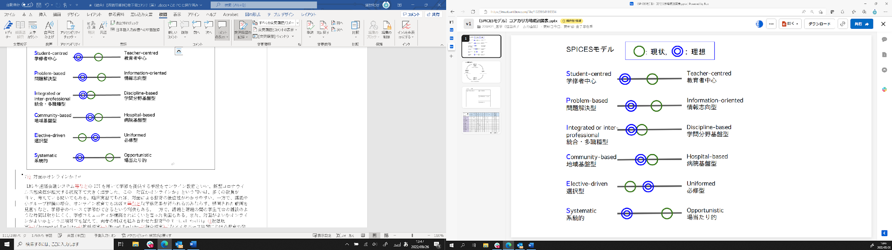
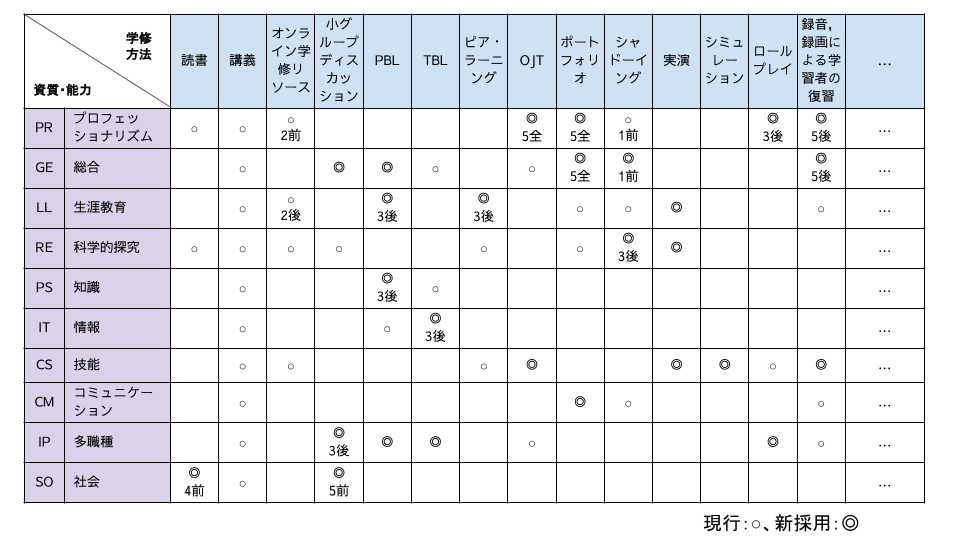

# 学修方略

　第2章に記した学修目標は主に「何を教えるのか？」について言及している。一方で、教育を計画・実施する際には、何を教えるのか(What to teach)だけでなく、どう教えるのか(How to teach)、どう評価するのか(How to assess)も検討する必要がある。第3章では、方略(どう教えるのか？)と評価(どう評価するのか？)について取り上げる。学修目標を達成するために必要な具体的な教育方法(Teaching Method)と学修する順序、人的資源や物的資源、対象者、人数、選択・必修等のより大きな教育戦略(Educational Strategy)を合わせて、「学修方略」という。

## 学修方略を考えること

 「どう教えるのか？」を考える際には、例えば、講義にするのか、グループ討議にするのか、PBLを採用するのか、といった具体的な教育方法を検討することになる。
「どう教えるのか？」は、学修目標、教育環境、学修者の特性等、さまざまな要素に依存するため、これが絶対に良い、という教育方略は存在しない。よって、現場で実践し、振り返りながら、改良を重ねていくことになる。その際に役立つ教育学理論と鍵となる問い、そして学修を効果的にするいくつかの方法を以下に記載する。本章の最後には、Good Practice事例を紹介している(Ⅲ. 方略・評価の事例参照)。ぜひ参考にして、各大学でさらに工夫を重ねて教育をより良いものにしていただきたい。

## 学修方略を組む際に役立つ教育学理論

### 成人学習理論

　高等教育として位置付けられる医学教育において、成人学習理論の理解は重要である。nowlesは、成人の学習プロセスは自己概念、過去の経験、学習へのレディネス、学習への方向性、動機付けという5つの要素について成人特有の特徴があり、子どもを対象とする教育学(Pedagogy)と対比して、成人を対象とする教育学(Andragogy)を提唱した。成人学習理論は20世紀終盤に開発された学修者中心性の高い医学教育カリキュラム(例：Problem-based Learning等)の基盤となる理論として活用されてきた。例えば「学修者がこれまでに学んできた内容と関連づけて授業を計画する」といったような活用が可能である[@Saiki2013]。成人教育理論では、能動的学修(アクティブ・ラーニング)が推奨されている[医学教育イントロダクション　医療系学生を支えるすべての指導者へ: 日本医事新報社; 2022.]。講義の前に自主学修を課すこと(反転学修)、ICTを活用して双方向性にコミュニケーションができるよう工夫すること、などが例として挙げられる。

## 行動主義と認知主義と構成主義

　行動主義は、人の学習や思考プロセスは、その人の行動から予測可能と捉える心理学的立場である。この考え方は、20世紀の教育心理学において、学修者にどのような学修内容を与えれば、どのような行動をするかという観点から活用された。一方で、行動さえ変われば何を考えていてもよいのか、あるいは何も考えなくてもよいのかという批判や客観的な知識のみを評価する試験至上主義を招いた等の批判が生じた。これに対し、認知主義では、行動主義が行動のみに着目していたのに対し、人は情報が入ってからどのように処理されて、どのように蓄積されて、そしてどのように記憶が引き出されているのかという点に注目し、注意と意識、言語、情動、視覚、聴覚、運動を学習に包含した。構成主義では、学修者の既存知識に、学修者にとって意味のある新たな情報を積み重ねることで、鍵となる概念(Key Concepts)や重要概念(Big Ideas)が形成される能動的なプロセスそのものが学びであると考えた。これらの概念は、細かい知識を単独で記憶することでは獲得されず、周囲の学修者と相互に交わりあいながら得られるものである。構成主義は上述した成人学習理論と相性が良い一方、我が国の医学教育の現場ではまだあまり活用されていないという課題がある[@DOI10.11307mededjapan.43.290]。

### Kolbの経験学修論

　診療参加型臨床実習実施ガイドラインの「経験と評価の記録」の基盤となっている理論である。Kolbは、学修経験を経験のみで終わらせず、自らの経験を振り返って分析、つまり省察することで学びをえることで、学びを一般化(抽象的概念化)して、小規模・安全な状況で試行し、再び経験する、という4つのプロセスの循環としてとらえた(Kolbの経験学修モデル)[Kolb AY, et al. The experiential educator: Principles and Practices of Experiential Learning; LIGHTNING SOURCE Incorporated: 2017.]。特に実習においては、具体的な経験をした後に、それを省察する(振り返る)機会を作ることで、この学習サイクルが循環することとなる。

{width=424}

::: {.note}
コラム「インストラクショナルデザイン」 ### インストラクショナルデザインとは 　インストラクショナルデザイン(Instructional Design)は、質の高い教育を設計し、実践するための方法論である。インストラクショナルデザインの目的は、対象となる教育の効果・効率・魅力を高めることにある。 　 　学修者に応じて適切な目標を設定し、到達できるような教育を設計・実践することが効果的な教育に求められる。例えば心音の聴診を扱う場合、教える対象がOSCE前の学生であれば、聴診における作法や聴診器を当てる部位を理解していることが目標となり得る。一方、臨床実習終了後の学生が対象であれば、心音を聴診したうえでその音の種類を判断し、臨床推論に利用することができるといった目標も設定可能であろう。 　効率の向上には、教育にかかる人的・物的・時間的・金銭的等のコスト面が関係する。聴診の例でいえば、学生1人1人が模擬患者やシミュレーターで実習できる環境を整えるのか、タブレット等のアプリで擬似的に体験できるようにするのか、あるいは講義や動画で情報を伝えることに留めるのか、等が挙げられる。これらは教育の方略を選択する際にも重要となる点である。 　魅力を高めることは、学生の意欲を継続させ、生涯学習へとつなぐことを意味する。入学直後に行われる早期体験実習等を通じて医学・医療に対する興味関心が高まるように工夫すること、臨床実習中の経験等を将来の専門分野選択に活かせるようにすること、などが例として挙げられる[@DOI10.15077jjet.KJ00004286879]。 ### インストラクショナルデザインの第一原理 　インストラクショナルデザインは種々の理論が提唱されている。Merrillはインストラクショナルデザインの第一原理として、その共通項をProblem, Activation, Demonstration, Application, Integrationという5つの要素に整理した[@DOI10.1007BF02505024]。 　Problemは現実世界で起こりうる問題・課題を扱うことを意味する。例えばPBLの課題として、臨床実習ですぐに直面するであろう症例を扱うことは、目標を明確化し、学修意欲を向上させることにつながる。Activationは既習内容や経験を想起させ、新しい知識と関連づけることを意味する。臨床の場で目にした症例に関して、講義や教科書で学んでいた知識、あるいは類似の症例などに対比させて学修することなどが挙げられる。 　Demonstrationは具体的な例を学生に示すことを、Applicationは学生に実施・実演させることを意味する。シミュレーションで手技を扱う際、教員による実演や動画を用いた例示を行った後、学生に練習・実施させるという方略が例として挙げられる。 　Integrationは知識や技能を日常生活や業務に統合することを意味する。参加型臨床実習、さらには卒後において、臨床の場面で医行為を実践すること、実践した結果を省察して新たな学びへと結びつけることが例として挙げられる。
:::

## 学修方略を考える際に鍵となる問い

　学修方略を考える際に鍵となる問いを以下に列挙する。最初に挙げる6つの項目は、Hardenが提唱した「SPICESモデル」から引用し[@HARDEN_1984]、さらに今日の医学教育の状況を考慮して、問いを追加した。自身が関わっているカリキュラムにおける教育方略を分析・計画する際に、以下の問いについて考えると、整理ができてわかりやすい。

### 学修者中心か、教育者中心か？

　学修者中心の教育では、教員はあくまでガイド役であり、学修者が自己の学修に責任を持ち、学修ニーズや目標を把握し、自ら選んだ方法で学び、自己評価する(自己主導型学修)。学修者は能動的な学び方をする傾向があり、また教材(動画も含む)が重要な役割を果たす。能動的学修(アクティブ・ラーニング)は学修者中心の教育と言え、例えば、グループ討議等で学修者が積極的に発言できるような機会を作ることなどは、学修者中心の教育と言える。教育者中心の教育では、学修した後の景色は学修者には見えない(だから学修者は学ぶのである)という立場に立ち、教育者が学修を先導する。自らが選択して学ぶわけではないため、受動的な学びになりがちで、学修の動機づけがやや弱くなる。しばしば教育者がカリスマ的な役割を果たす。ひたすら話し続ける講義や動画配信のような一方向性の教育は教育者中心の教育と言える。

### 問題解決型か、情報志向型か？

　問題を解決するという行為は、臨床現場で臨床医に求められる業務と相性が良い。また成人学習理論からも問題解決型の学修は有効と考えられる。実践から問題を設定し、その解決のために理論を学ぶ、という学修の順番を好む学修者には有効である。事実や概念、原則を習得するときや、学問分野を体系的に理解するには、情報指向型の方が有効である。また未知の領域に知見を積み重ねることの重要性を伝えるには、情報志向型の方が効果的であるとも考えられる。理論を先に学んでから実践に臨むことを好む学修者に有効である。

### 統合型か、学問分野基盤型か？

　学問分野基盤型では、それぞれの学問分野ごとに学修を進めていく。それぞれの学問の歴史を学べること、教育実績が強固であることが強みである。またそれぞれの学問分野で何がわかっていないのか、ということについて取り上げることで、科学的探究に関連する能力の涵養も期待できる。一方で蛸壺型になってしまうという欠点がある。統合型では、一つのテーマに対して、基礎医学・社会医学・臨床医学のそれぞれの学問分野からのアプローチを統合させる形で教育を設計する。水平的統合(例：人体の構造と機能について、生理学、解剖学、外科学など多分野の講座が担当する)、垂直的(連続的)統合(例：腫瘍について、解剖学、薬理学、臨床腫瘍学と低学年から高学年にわたって基礎・臨床教室ともに担当する)等といった教育方略は、実践へ応用可能な知識基盤を構築する際に有効である[@田川 まさみ2014]。

### 地域基盤型か、病院基盤型か？（臨床教育）

　学修目標に応じて、病院か地域かという問いを基盤に、どこで学修するのがよいのかを考える。病院基盤型であれば、指導医が多く、入院患者の診療を多く経験しやすい。また高度先進医療について学ぶことができる。一方、地域基盤型では、プライマリ・ケアについて学ぶことができ、また、介護・福祉との連携、医療の社会的な側面等について学ぶことができる。病院と地域がうまく連携できるように計画するとよい。

### 選択型か、必修型か？

　医学教育モデル・コア・カリキュラムは全ての医学生に対して必修とする項目を扱っている。自分の専門分野・診療科に進まない学生にとって最低限修得しておくべき内容は何か、という問いについて常に考えておく。選択型の場合、学修者が自ら(その科目を)選択するという行為、また学修方法を自ら選択できるということ自体が、学修への動機づけを高めることがしばしばある[@田川 まさみ2014]。

### 系統的か、場当たり的か？

　臨床実習において学ぶ内容は、担当する患者さんに依存するため、場当たり的になる。一方で、シミュレーション教育によって、学ぶべき症候や疾患全てを網羅した系統的な学修が可能になる。実務経験を通じた学修をOn-the-Job Training(OJT)、それ以外の実務と離れて行う学修をOff-the-Job Training(Off-JT)と呼ぶが、臨床実習はOJTの代表例である。OJTによる学びの利点は、セッティングを転用する必要がない点にある(その場で学んだことがそのまま活かされる)が、上記のとおり、学びが場当たり的なものになりがちで、学修効率は悪いとされる。一方で、Off-JTの代表例であるシミュレーション教育は、学ぶべき内容を系統的かつ効率的に学ぶことができるが、セッティングを転用する必要がある10F[@DOI10.1002lrh2.10024]。講義は系統的に計画できるが、PBLのような課題基盤型の学修は場当たり的になりがちである。PBLを主体としたカリキュラムを組む際には、学生が学ぶべき内容全体を系統的に学べているかどうかについて、確認する必要がある。

::: {.note}
コラム　Good Practice紹介「学内ワーキンググループによるSPICESモデルを用いた学修方略の見直し」 　現実のカリキュラムがそれぞれのスペクトラム上のどのあたりに位置するのかを可視化し（図の〇印）、次に自身が理想とする教育戦略がスペクトラム上のどのあたりに位置するのかを同様に可視化できる（図の◎印）。理想と現実が可視化されることで、この差を埋めるためにどのようにすればよいのかを分析できる。このように、カリキュラム開発の戦略を俯瞰するモデルとしてSPICESモデルは活用できる。 {width=586}
:::

### 対面かオンラインか？

　LMSや Web会議システム等のICTを用いて学修を提供する手段をオンライン教育といい、新型コロナウイルス感染症が拡大する状況下で大きく進歩した。この「対面かオンラインか」という問いは、多くの教員が日々、考えている問いでもある。臨床実習であれば、対面による教育の優位性がわかりやすい。一方で、講義や小グループ討議の場合、オンライン教育でもほぼ同等な学修効果が得られるのみならず、録画された動画を見直す等、学修者のペースで学修ができるという利点もある。一方で、講義と講義の間の学生同士の雑談のような時間は取りにくく、学修コミュニティが構築されにくいと言った側面もある。また、対面がよいかオンラインがよいかという二項対立を超えて、両者の利点を組み合わせた教育[@DOI10.1186s12909021028881]やVirtual Reality(仮想現実)、Augmented Reality(拡張現実)、Mixed Reality(複合現実)等メタバース空間における教育の発展が今後は予想される。対面とオンラインの利点を組み合わせて実施する教育はハイブリッド型学修とよばれ、大きく分けてブレンド型、分散型、ハイフレックス型等がある[http://id.ndl.go.jp/bib/031268764]。ブレンド型は、1回目の授業はオンライン、2回目の授業は対面、というように、実施内容と回に応じて形式を切り替える方策である。分散型は学生を複数のグループに分け、たすき掛けで対面とオンラインとを入れ替えて実施する形式である。ブレンド型と異なり、対面授業の参加人数を調整可能なため、コロナ禍等での実施には適している形式である。一方、学生によってコンテンツを学ぶ順番が異なる場合が生じうるため、スケジュールを組む際には注意が必要である。ハイフレックス型は、ある1回の授業について、対面・同時双方向・オンデマンド等種々の形式で学生が受講できるような形式にしたものである。例として、教室で実施している授業(対面)を遠隔会議システム等で遠隔に配信し(同時双方向)、終了後にはLMSで資料を提示することで後日の学修を可能とする(オンデマンド)、などの形式がある。分散教育の実現や自宅待機者への教育等にも柔軟に対応しやすい反面、授業の準備や運営には非常にコストがかかる方式となる。

::: {.note}
コラム　Good Practice紹介「ハイブリッド型学修を用いた臨床実習の組み方」 　臨床実習において、病棟での実習と小グループでの講義が混在している状況も、一種のブレンド型と考えることができる。知識に関する教育は遠隔（同時双方向やオンデマンド）で実施し、技能や態度に関する教育は対面でのシミュレーションや実習で行う、などの組み合わせが考えられる。 　また、遠隔教育のみで行う授業であっても、同時双方向とオンデマンドを組み合わせたブレンド型授業も可能である。なお、対面であれば対面、オンラインであればオンラインで、対象となるすべての学生が参加するため、コロナ禍等で人数制限が生じている教室を利用する際等は注意が必要である。
:::

::: {.note}
コラム　ICTの紹介「VR」 　Virtual Reality（仮想現実）の略である。2次元または3次元の仮想的な空間を作り出し、その中で学修活動を行う。類語としてAR（Augmented Reality：拡張現実）やMR（Mixed Reality：複合現実）等もある[@Jiang_2022]。 　例えば解剖学実習において、献体による解剖実習を行う前の事前学修等に用いられる事例がある。また、従来は高価なマネキンを使わざるを得なかったシミュレーション教育に関して、多人数に対して同時に、あるいは遠隔で実施する際などに活用できる。現実の献体やマネキン型シミュレーターを利用する場合と比較してリアリティーが低下することはあるが、繰り返しの学修が可能であること、タブレットやPC等でも利用可能であることなど、利点も多い。 　ヘッドマウントディスプレイ等を用い、360度カメラの画像等を投影することで、病院や診療所等の環境を疑似体験することにも応用可能である。
:::

### 同期型か非同期（オンデマンド）型か？（オンライン教育）

　非同期(オンデマンド)型学修とは教員と学生とが異なる時間軸で教育・学修を進める形態である。教員は予め、動画講義や演習問題等を用意しておき、学生は自分のタイミングでアクセスして自学自習することになる。疑問点等があった場合はメールやオンライン掲示板等で対応されることが多い。こうした一連の作業を行いやすくするため、LMS等を用いて実施される場合が主である[@DOI10.10800142159x.2021.1992373]。非同期型にすることの利点は、特に知識の学修に関しては、動画や資料を繰り返し閲覧できる点、演習問題を利用して学修できる点等の利点がある。一方、基本的には学生が1人で学修を進める必要があるため、学修意欲を維持することが困難になる場合も生じうる。このため、同時双方向型の授業を適宜組み合わせる等の対応も検討する必要がある。また、レポート課題等に対し、個別のフィードバックを行うことも有用である。

::: {.note}
コラム　ICTの紹介「LMS」 　Learning Management Systemの略である。Course Management System (CMS) や Virtual Learning Environment (VLE) と呼ばれることもある。オンライン授業で活用するための教材や評価を一元管理するためのシステムである[@DOI10.108001421590802108331]。 　 　特にオンデマンド型の教育に際し、(1)動画やPDF等の閲覧用教材を提示する、(2)多肢選択等の知識確認問題を提示する、(3)掲示板を通じた学生同士でのディスカッションや教員への質疑対応に用いる等の方略で用いられることが多い。一方で、対面型授業や同時双方向型のオンライン授業においても、その場で問題を解かせたり、クリッカー代わりに使わせたりする等の活用が可能である。加えて、実習記録や日誌等の簡易的なポートフォリオとしての応用も可能である。 　また、各教材の完了状況や実施日次、成績等を横断的にみることで、学修支援に活用することもできる。教材の進捗状況に応じ、より深く学びたい学生には追加教材を提示したり、途中で伸び悩んでいる学生に補助教材を提示したりするような、テーラーメイド型の教育も可能となる。
:::

### 教育資源をどのように手配するか？

　方略を検討する際には、実現・持続可能性を考慮するため、教育資源に配慮する必要がある。人的資源（誰が教えるのか？誰が教育に協力してくれるのか？：病院・診療所・患者さん等）、時間的資源（いつ・どのくらいの時間で教えるのか？）、空間的資源（どこで教えるのか？対面かオンラインか？）、物的資源（何を使って教えるのか？）、経済的資源（そもそもどの程度費用がかかるのか？）等を検討する必要がある[@PMID20697551]。例えば、外部講師に支払う謝金や旅費、シミュレーターのランニングコスト等が含まれる。

## 学修を効果的にするための方法

　ここでは、医学教育において一般的に広く用いられている学修方法のなかから、効果的と考えられる学修方法をいくつか紹介する。望ましい学修方法は、学修環境や学修者によって異なるため、本章で紹介している学修方法が最善解というわけではないことに留意する。近年では、ICTの発展に伴い、学修方法はさらに発展、多様化している。詳しい解説については論文(医学教育学会誌等)や成書を参照し、適宜情報更新されたい。

### 反転学修・授業

　学修者が授業前に教科書や文献等をもとにあらかじめ割り当てられた課題を事前学修してから授業に参加する。授業では学修者が事前学修による知識が獲得されていることを前提として、教員は学修者の知識の応用や、批判的な思考スキルの獲得を目的に授業をファシリテーションする。

### ロールプレイ

　ある学修者が１つの役割を演じ(例：医師)、もう一人の学修者もしくは教員が別の役割(例：患者)を演じることで、学修者がさまざまな立場や役割を疑似体験することができる。医療面接や身体診察スキルの習得等に活用されることが多い。学修の反復が可能であることがメリットであり、また演じた学修者間で互いの体験を議論することで省察を促すことができる。

### シミュレーション

　現実に近い学修環境を人工的に作り出し、学修者が与えられた課題に関して問題解決を行う。リアリティーを促進するためにシミュレーター等が用いられることもあるが、模擬患者や身体部分模型、VR等も活用可能である。

### Problem-based Learning （PBL）

　PBL(問題基盤型学習)は、知識の暗記といった受動的な学修ではなく、自らが能動的に問題を見つけ出し、解決へ向かう能力を養う教育法である。PBLでは、患者の事例等を題材に小グループで討論しながら学生自身が自分の力で問題を発見すること、発見した問題を解決するために自ら学修を進めていくことが求められる。教員は知識を教えるのではなく、グループについて、進行を見守り、学生が発見した問題が本質をとらえているか、解決するための学修が適切であるか等の助言を行う。典型的なPBLでは小部屋に分かれて1グループに1名の教員がチューターを務めるためマンパワーを要するが、ある程度広い部屋に複数グループを配置して実施することも可能である。

### Team-based Learning （TBL）

　TBL(チーム基盤型学習)は、学修者個人とグループの点数を合算して評価することが特徴である。TBLの授業に先立ち、教員は事前学修課題を準備し、学修者は自主学修を行う。授業ではまず準備確認試験を行い、個々の学生を評価する。続いて、同じ問題でグループ準備確認試験を行う。グループ準備確認試験では、スクラッチカード等により正誤が即時にフィードバックされる。引き続き、グループで準備確認試験で身に着けた知識を応用して解決する応用課題に取り組む。応用課題に関するグループ内討論の後に、教員の司会でグループ間で討論が行われ、討論のなかで正解が導かれる。

### Case-based Discussion （CbD）
　Case-based Learningと呼ばれることもある。特定のケースに基づき学修者と教育者で構造化されたインタラクションを通じて、臨床推論や意思決定等を学ぶ方法である[@Kassirer_1983]。事例には現場に関係する文脈(置かれた状況や背景等)が記載されているため、文脈がない学修より知識の応用等の面で効果的な学修方法といわれる[@DOI10.1111j.19378327.1993.tb00605.x]。

### Peer Learning

　同僚間教育とも呼ばれ、一般に同等の学修レベルの学修者が教え合うことを示す。Peer-assisted Learning (PAL：同僚支援学習)とも称される。このうち、上級生や下級生を教える形態はNear-peer learningと呼ばれ、屋根瓦式教育と同義と考えられる。双方の認知的近接性を背景に、教育上の足場がけ(Scafold)が効果的に可能であること、心理的安全性が保持されることがその利点とされる。一方、教育内容の質保証のために、教師側への指導内容や指導方法の教授としてのチューター養成も重要である。

### 診療参加型臨床実習

　臨床実習では見学にとどまらず、診療に積極的に参加する形態をとることで、より問題基盤型で自己主導型の学修となり、成人学習理論に合致した方法である。教育者はやってみせる段階から徐々に学修者に議論や臨床経験を体験させる。得られた知識の例示化や学修者の内的過程を外化するように働きかけ、熟練者の問題解決の過程を習得していく(認知的徒弟制)[@Brown_1989]。最初は周辺の小さな役割 (責任)を持って徐々に主体的に中心的役割を担っていくように設定するとよい(正統的周辺参加)[Situated learning:Cambridge University Press;1991.]。臨床実習の設計については診療参加型臨床実習実施ガイドラインを参照されたい。

| コラム　診療参加型臨床実習の準備教育①「 シャドーイング」 　学生や研修生のような学修者が、1日、1日の一部、またはそれ以上の期間、専門職の後ろにつき、その専門職のコンピテンシーを学び、キャリア選択を考える等の目的で実施する教育機会である( https://students-residents.aamc.org/aspiring-docs-fact-sheets-get-experience/shadowing-doctor )。医師になる前に、医師の典型的な1日を学ぶなかで、複雑な業務の内容を理解できる。医師以外の職種につくことで、他職種の役割やチームワークを学ぶこともできる[@Rosen_2013]。 シャドーイング自体は受動的学修であるが、診療参加型実習での準備教育となり、学修意欲を高めることに役立つ。 |
| -- |
| コラム　診療参加型臨床実習の準備教育②「早期臨床体験実習」 　学部教育の早い時期に、医学・医療の現場に接する実習であり、実際の患者やロールモデルとなる臨床医と接することで、学修意欲を向上させることができる。レポートを記載する等、省察する機会を設けておくことが重要である。省察の機会を設けることで、体験に基づいた自分の考えを客観的にとらえ、概念化し、今後の課題を見出すことができる(Kolbの経験学修論)。 |

### Significant Event Analysis（SEA）

　行動において省察する意義がある(Significant)と思われた、あらゆる事象(Event)を取り上げ、物事が起こった原因を構造的に振り返り、改善策の立案に活かす手法である。学修者自身が省察し、学びを得るための方略・評価方法として用いられることが多い。省察を基盤とするために、多種多様な事象に適用することが可能であるが、特に情動領域の教育に用いやすい。例えば、プロフェッショナリズム教育の一例に挙げると、建前では一定の行動規範がたとえあったとしても、現実に照らし合わせるとどう行動すべきか困惑したような事象について、SEAシートに記載することで省察し、さらに教員や同僚と共有して議論を行う。

### 学修ポートフォリオ

　学修者が意図的に収集した1つまたは複数の領域における学修者の経験、進歩、及び成果のコレクションであり、これらの成果物の選択には学生が主体的に関わり、その成果物を収集した理由、及び学修者の振り返りの証拠が含まれている必要がある[What makes a portfolio a portfolio? Educational Leadership. 1991;48(5):60-3]。医学教育におけるポートフォリオについては「学修の文書化と学修内容の明確化」として、学修者の経験の記述と考察・振り返り、問題領域に関する考察・振り返り、学修した内容、及び新しい学修ニーズに取り組む方法の計画等も含まれる[@Snadden_1998]。

::: {.note}
コラム　講義中心のカリキュラムを見直す 　カリキュラムを組み直す際には、まず、現行の時間割を医学教育モデル・コア・カリキュラム (令和4年度改訂)の資質・能力と突合して、過不足を確認する必要がある。 各分野を担当する教員とは、対象となる資質・能力を確実に情報共有するとともに、学修方略についても見直しを行う。 　 現行のカリキュラムが「講義中心」なのであれば、たとえば下図のように各資質・能力の修得に向いている新たに取り入れたい学修方法は何か、各担当教員とも協議し、シラバスの組み直しを行うとよい。 {width=586}
:::

※上記表の数字と「前」「後」という記載は、学年と前期・後期を表す。例)2前：2年生前期
